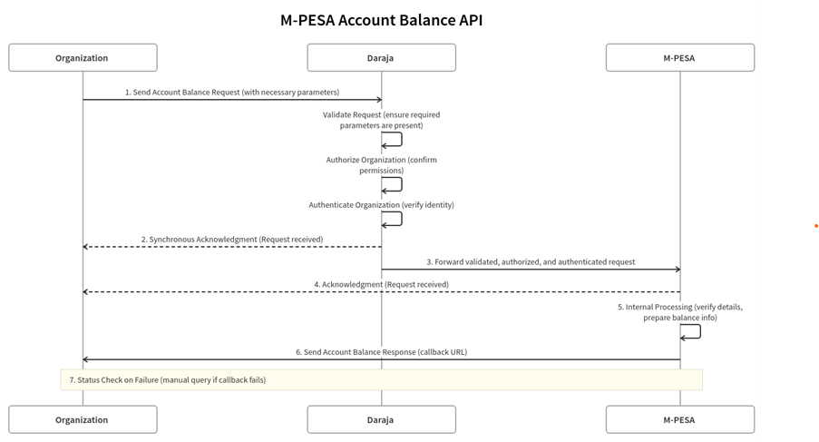
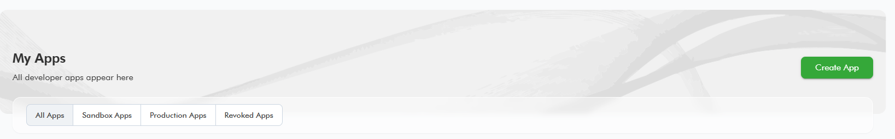

# AccountBalance
**Source:** https://developer.safaricom.co.ke/apis/AccountBalance

---

[](/)

HomeAPIsDashboardMarketplaceFAQsMiniApps

Log Out

1. Discover APIs
2. /
3. Account Balance


###### Account Balance

By Safaricom

Enquire the balance on an M-Pesa BuyGoods (Till Number)

POST

https://sandbox.safaricom.co.ke/mpesa/accountbalance/v1/query

Use API

Get Started in 3 easy steps


Open Simulator

###### DOCUMENTATION

- Overview

- How It Works

- Getting Started

- Integration Steps

- Go live

- How To

- Support

## Overview

The M-PESA Account Balance API by Safaricom enables organizations to programmatically check their M-PESA account balances. This is essential for automating financial processes, monitoring account status, and ensuring sufficient funds for operations.

**Key Features:**

* **Real-time Balance Inquiry:** Instantly retrieve your M-PESA account balance.
* **Secure Access:** Authentication and authorization ensure only permitted entities access the balance.
* **Automated Responses:** Receive automatic acknowledgments and responses to inquiries.

## How It Works

1. **Request Setup and Submission:**  
   • Action: The Organization configures the request with all necessary parameters.  
   • Endpoint: The request is sent to <https://sandbox.safaricom.co.ke/mpesa/accountbalance/v1/query>.  
   • Purpose: This step initiates the process of querying the account balance via the M-PESA system.
2. **Acknowledgment by Daraja:**  
   • Action: Upon receiving the request, the API Management Platform (Daraja) performs several checks.  
   • Validation: Ensures that all required parameters are present and correctly formatted.  
   • Authorization: Confirms that the Organization has the necessary permissions to access the API.  
   • Authentication: Verifies the identity of the Organization.  
   • Response: Daraja sends a synchronous acknowledgment back to the Organization indicating that the request has been received and is being processed.
3. **Forwarding to M-PESA:**  
   • Action: Daraja forwards the validated, authorized, and authenticated request to the M-PESA system for further processing.
4. **Acknowledgment by M-PESA:**  
   • Action: M-PESA receives the request and performs initial validation.  
   • Response: M-PESA sends an acknowledgment response back to the Organization, confirming receipt of the request.
5. **Internal Processing:**  
   • Action: M-PESA processes the request internally. This involves verifying the details and preparing the account balance information.
6. **Response Callback:**  
   • Action: Once processing is complete, M-PESA sends the account balance response to the Organization.  
   • Method: The response is sent to the callback URL specified by the Organization in the initial request.
7. **Status Check on Failure:**  
   • Note: If M-PESA is unable to deliver the callback (e.g., due to network issues), there are no automatic retries.  
   • Action: The Organization can manually check the status of the transaction by querying M-PESA portal if the callback fails.

> **Note:** This API is asynchronous and can be accessed via the internet, VPN, or Multiprotocol Switch.

## Getting Started

### Prerequisites

* Create a Daraja Account on the [Safaricom Developer Portal](https://daraja.safaricom.co.ke/).
* Create a sandbox app to obtain API credentials.
* Retrieve Consumer Key & Consumer Secret from [My Apps](https://daraja.safaricom.co.ke/dashboard/myapps).
* Use test data from the simulator section.
* For production, ensure you have a live pay bill/till number with Business Admin/Manager operators.

### Good to Know

This API is asynchronous and is used to check the status of various M-PESA transactions, including C2B, B2B, B2C, Reversal, and IMT.

## Authentication

Generate an access token before making API calls. See the [Authorization API](https://daraja.safaricom.co.ke/dashboard/apis?api=Authorization). Token generation is automated in the simulator section.

## Environments

| Environment | Description | URL |
| --- | --- | --- |
| Sandbox | Testing environment | <https://sandbox.safaricom.co.ke/mpesa/accountbalance/v1/query> |
| Production | Live transactions | <https://api.safaricom.co.ke/mpesa/accountbalance/v1/query> |

## Integration Steps

### Sequence Diagram



### Use Cases

1. **Financial Reconciliation**  
   *Scenario:* A business needs to reconcile its daily transactions with its M-PESA account balance.  
   *Process:* The organization schedules a balance query at the end of each business day to ensure all transactions are accounted for and reconciled with their internal records.
2. **Automated Payment Systems**  
   *Scenario:* An e-commerce platform automates payments to vendors through M-PESA.  
   *Process:* Before initiating payments, the platform queries the M-PESA account balance to ensure there are sufficient funds to cover all outgoing payments. If funds are insufficient, the platform triggers an alert for manual intervention.
3. **Fraud Monitoring**  
   *Scenario:* A financial institution uses M-PESA for various transactions and needs to monitor fraudulent activities.  
   *Process:* The institution sets up periodic balance checks to detect any unauthorized withdrawals or discrepancies in account balances, helping to identify potential fraud quickly.
4. **Cash Flow Management**  
   *Scenario:* A retail chain manages its cash flow by monitoring the balance of multiple M-PESA accounts used across different branches.  
   *Process:* The head office queries the balance of each branch’s M-PESA account at regular intervals to manage and allocate funds effectively, ensuring each branch has sufficient operating capital.
5. **Payroll Processing**  
   *Scenario:* A company uses M-PESA to disburse salaries to its employees.  
   *Process:* Before processing payroll, the company queries the account balance to confirm there are enough funds to cover the total payroll amount. If not, the finance team tops up the account accordingly.
6. **Bill Payments**  
   *Scenario:* A utility company allows customers to pay bills via M-PESA and needs to monitor the received payments.  
   *Process:* The company queries the account balance periodically to track the total payments received and ensure accurate recording in their financial system.

Below are the detailed accounts for the B2C, buy goods, and pay bill short codes:

| B2C Accounts | Pay bill Accounts | Buy Goods Accounts | Description |
| --- | --- | --- | --- |
| Utility | Utility | Merchant | This is the account that receives payments in both pay bill and Buy goods.A utility account in B2C is for the disbursement of funds. |
| Working (MMF) | Working | Working | It’s a transition account that holds money awaiting settlement to the bank or your individual M-PESA account. |
| Charges paid | Charges paid | Charges paid | This account deducts charges incurred depending on the business tariff you are in. |
|  | Organization Settlement |  | After charges are deducted, money passes here to the working account. |

## Request Body

```json
{
    "Initiator": "testapiuser",
    "SecurityCredential": "SAFVNChNHfVtXEZMBuVo+a1Hwr+DtrUVN3zVg==",
    "CommandID": "AccountBalance",
    "PartyA": "600000",
    "IdentifierType": "4",
    "Remarks": "ok",
    "QueueTimeOutURL": "http://myservice:8080/queuetimeouturl",
    "ResultURL": "http://myservice:8080/result"
}
```

## Request Parameter Definition

| Name | Description | Type | Sample Values |
| --- | --- | --- | --- |
| CommandID | A unique command is passed to the M-PESA system. Max length is 64. | String | AccountBalance |
| PartyA | The shortcode of the organization querying for the account balance. | Numeric | 600772 |
| IdentifierType | Type of organization querying for the account balance. | Numeric | 4 |
| Remarks | Comments that are sent along with the transaction | String | tests |
| Initiator | API user’s credential/username used to authenticate the transaction request | Alpha-Numeric | Testapi772 |
| SecurityCredential | Initiator password is encrypted to give the security credentials. | String | EToK4lNR... |
| QueueTimeoutURL | The end-point that receives a notification in case of a timeout. | URL | <https://ip:port/path> or domain:port/path |
| ResultURL | Destination URL which Daraja should send the result notification to. | URL | <https://ip:port/path> or domain:port/path |

## Response Body

```json
{
    "OriginatorConversationID": "515-5258779-3",
    "ConversationID": "AG_20200123_0000417fed8ed666e976",
    "ResponseCode": "0",
    "ResponseDescription": "Accept the service request successfully"
}
```

### Response Parameter Definition

| Name | Description | Type | Sample Values |
| --- | --- | --- | --- |
| OriginatorConversationID | Unique identifier of the request message. Auto-generated by M-PESA for a third party/Organization. | String | 515-5258779-3 |
| ConversationID | Unique identifier generated by M-Pesa for a previous request message. | String | AG\_20200123\_0000417fed8ed666e976 |
| ResponseCode | Indicates whether Mobile Money accepts the request or not. | String | 0 |
| ResponseDescription | Description of the parameter Response Code. | String | Accept the service request successfully |

## Response Error Codes

| errorCode | errorMessage | Mitigation | HTTP code |
| --- | --- | --- | --- |
| 401.002.01 | Error Occurred - Invalid Access Token - XXX | Regenerate a new access token and use it before one hour expiry period. Ensure you’re using the correct credentials. | 401 |
| 400.002.02 | Bad Request – Invalid XXXX. | Ensure the request payload is set as per API documentation. | 400 |
| 404.002.01 | Resource not found | Make sure you are calling the correct API endpoint. | 404 |
| 405.001 | XXX Method Not Allowed | Ensure you’re passing B2C request as POST. Any other method will be rejected. | 405 |
| 500.002.1001 | Duplicate OriginatorConversationID | Ensure the OriginatorConversationID being passed is unique for every request. | 500 |
| 500.003.1001 | Internal Server Error | Make sure everything on your side is correctly set up and your server is running as expected. | 500 |
| 500.003.02 | Error Occurred: Spike Arrest Violation | This means you’re sending multiple requests that violate API transaction per second limit set. Ensure your application/system is working correctly and not sending multiple requests. | 500 |
| 500.003.03 | Quota Violation | Sending multiple requests that violate API requests limit set. Ensure your application/system is working correctly and not sending multiple requests. | 500 |

## Callback Result Payload

After processing the reversal request on M-PESA, you get feedback via the ResultURL which you need to have specified beforehand in the Reversal request.

### Result body

```json
{
    "Result": {
        "ResultType": "0",
        "ResultCode": "0",
        "ResultDesc": "The service request is processed successfully",
        "OriginatorConversationID": "16917-22577599-3",
        "ConversationID": "AG_20200206_00005e091a8ec6b9eac5",
        "TransactionID": "OA90000000",
        "ResultParameters": {
            "ResultParameter": [
                {
                    "Key": "AccountBalance",
                    "Value": "Working Account|KES|700000.00|700000.00|0.00|0.00&Float Account|KES|0.00|0.00|0.00|0.00&Utility Account|KES|228037.00|228037.00|0.00|0.00&Charges Paid Account|KES|-1540.00|-1540.00|0.00|0.00&Organization Settlement Account|KES|0.00|0.00|0.00|0.00"
                },
                {
                    "Key": "BOCompletedTime",
                    "Value": "20200109125710"
                }
            ]
        },
        "ReferenceData": {
            "ReferenceItem": {
                "Key": "QueueTimeoutURL",
                "Value": "https://internalsandbox.safaricom.co.ke/mpesa/abresults/v1/submit"
            }
        }
    }
}
```

### Result Body Parameter Definition

| Name | Description | Type | Sample Values |
| --- | --- | --- | --- |
| Result Type | 0: completed 1: waiting for further messages | Integer | 0 |
| Result Code | It indicates whether Mobile Money processes the request successfully or not. Max length is 10 | String | 0 |
| OriginatorConversationID | The unique identifier of the request message. This is auto-generated by M-PESA for third-party/Organisations. Its value comes from the response message. It can be used to check the status of the transaction. | String | 16917-22577599-3 |
| ConversationID | The unique identifier generated by M-Pesa for a request. | String | AG\_20200206\_00005e091a8ec6b9eac5 |
| TransactionID | It’s only for transactions. When the request is a transaction request, M-Pesa will generate a unique identifier for the transaction. | String | OA90000000 |
| ResultParameters | It is used to carry specific parameters for the account balance query. For each account, the fields are presented in the following order and separated by vertical bars (|): Format: |||<Available Balance>|| |  |  |
| Key | It indicates a parameter name. | String |  |
| Value | It indicates a parameter value. | String |  |
| Working Account Available Funds | Mmf account available balance. | Decimal | Working Account|KES|700000.00 |
| Working Account: Uncleared Funds | Mmf account uncleared balance. | Decimal | 700000.00| |
| Working Account Reserved Funds | A charge paid account reserved balance. | Decimal | 0.00| |
| Charges Paid Account Available Funds | A charge paid account available balance. | Decimal | Charges Paid Account|KES|-1540.00 |
| Charges Paid Account Uncleared Funds | A charge paid account uncleared balance. | Decimal | 1540.00| |
| Charges Paid Account Reserved Funds | A charge paid account reserved balance. | Decimal | 0.00| |
| Utility Account Available Funds | Utility account available balance. | Decimal | Utility Account|KES|228037.00 |
| Utility Account Uncleared Funds | Utility account uncleared balance. | Decimal | 228037.00| |
| Reference Item | It is used to carry some reference data that M-Pesa need not analyze but needs to record in the transaction log. | ParameterType[1..unbounded] |  |
| ReferenceData | Utility account uncleared balance. It is used to carry some reference data that M-Pesa need not analyze but needs to record in the transactions log. | ReferenceData |  |

## Error Codes

| Error Code | Description | Message Type | Details |
| --- | --- | --- | --- |
| 15 | Duplicate Detected | ApiResult | Currently, any requests which present an originator conversation id that has been seen before will be rejected. This rule will need to be reconsidered in contexts that require multi-stage conversations or multiple callers. This check (along with the message expiry check) is the first thing done by the transaction processor when handling an API request. The outcome is reported in the ApiResult message. |
| 17 | Internal Failure | ApiResult | A catch-all for failures that are not identified more specifically – this can occur in either the ApiResponse or ApiResult – although the intent is to replace any such error with a more precise message. |
| 18 | Initiator Credential Check Failure | ApiResult | The password check for the initiator failed, either because the presented password is wrong, or something has gone wrong in the encryption or decryption steps. This is issued in the ApiResult before the creation of a financial transaction. |
| 19 | Message Sequencing Failure | ApiResult |  |
| 20 | Unresolved Initiator | ApiResult | The initiator username presented with the request cannot be found. This is included in the ApiResult. |
| 21 | Initiator to Primary Party Permission Failure | ApiResult | The initiator presented does not have the right to issue requests for the specified primary party (as established during creation of the initiator on the admin web site). The is part of the ApiResult, and computed prior to issuing a financial transaction. |
| 22 | Initiator to Receiver Party Permission Failure | ApiResult | The presented initiator username can be received, but the initiator is not currently active. This fact is returned in the ApiResult. |
| 24 | Missing mandatory fields | ApiResponse | Required input parameters are defined for each type of API operation. If these are missing, then this is issued in the ApiResult message. The names of the missing parameters are included in the result parameters field. |
| 25 | InvalidRequestParameters | ApiResponse | If all required parameters are presented, then validation checks are performed. Specifically, the parameter is checked to see if it can be converted to the intended type. Failures are indicated in the ApiResult message, with the details included in the result parameters. |
| 26 | Traffic blocking condition in place | ApiResponse | SystemTooBusy: Included in the ApiResponse message if a traffic blocking condition is in place. |
| 29 | InvalidCommand | ApiResponse | The command specified in the request is not defined – this is part of the ApiResult. |
| 100000000 | Request was cached, waiting for resending | ApiResponse |  |
| 100000001 | The system is overload | ApiResponse |  |
| 100000002 | Throttling error | ApiResponse |  |
| 100000004 | Internal Server Error | ApiResponse |  |
| 100000005 | Invalid input value:%1; %1 indicates the parameter’s name. | ApiResponse |  |
| 100000007 | Service’s status is abnormal. | ApiResponse |  |
| 100000009 | API’s status is abnormal | ApiResponse |  |
| 100000010 | Insufficient permissions | ApiResponse |  |
| 100000011 | Exceed the limitation of request rate | ApiResponse |  |
| 00.002.1001 | Service is currently under maintenance. Please try again later |  |  |

## Next steps

## Testing

***Testing time Devs***

### Option 1: Daraja Simulator

Option 1 (Daraja Simulator): Create a new test app under apps on the main nerve bar, select Reversal app product. Once app is successfully created the simulator is automated to pick app credentials (Consumer key and Consumer Secret) and predefined test data, you can hit the simulate button.



### Option 2: Postman

Use the credentials to generate access token using the below endpoint.
- Sandbox: `https://sandbox.safaricom.co.ke/mpesa/reversal/v1/request`
- Production: `https://sandbox.safaricom.co.ke/mpesa/reversal/v1/request`
- Production: (see production details)
Initiate a transaction using the request body above.
Download the Postman collection and replace parameters with your credentials.

### GO LIVE

**Time to launch, here Dev you need help from the business teams no more Rambo stunts behind the keyboard. Some collaboration will do; a handshake to the business team in the morning it is. Wait! You can act Rambo if you are both the Business and Dev**

We’ve already tested, and finished development now attach the integration to a live pay bill/till number. Navigate to GO LIVE tab. Fill in the below fields with live data. We require a short code of a live pay bill or till number, the organization name and an M-PESA admin/manager username to successfully go live. Kindly visit our how-to section for more information on m-pesa org portal access and user creation.


Upon successful go live, production endpoints will be sent to developer email and the test sandbox app will be moved to production with production consumer key and secrets. Below is how to see the production app.

**We’ve successfully deployed dev congratulations we are now live!**

## How To

**Access to the M-PESA Organization Portal and create Users**

The M-PESA organization portal is a platform designed for businesses and organizations to manage their financial transactions through the M-PESA services.

The portal offers various features for businesses, including:

1. Transaction Management: Monitor and manage transactions, generate reports, and reconcile accounts.
2. Account Management: Manage multiple user accounts with different access levels within the organization.
3. Bulk Payments: Facilitate bulk payments to employees, suppliers, and other beneficiaries efficiently.

**Access to the M-PESA Organization Portal**


To access the Organization portal (<https://org.ke.m-pesa.com/orglogin.action>), you need to have a Business Administrator role created under your business short code (Pay Bill/ Till).

The first step before getting access, is to ensure the settlement option set to your short code is Bank via a Head Office application.

To make an application for a Head Office for your short code/Store Number kindly contact [M-PESABusiness@Safaricom.co.ke](mailto:M-PESABusiness@Safaricom.co.ke) where they will provide you with the forms to be filled.

After Head Office is created the [M-PESABusiness@Safaricom.co.ke](mailto:M-PESABusiness@Safaricom.co.ke) will also guide on the creation of the Business Administrator (username).

**How to login to M-PESA Organization Portal For the first time:**

1. Launch the link from any of the browsers: <https://org.ke.m-pesa.com>.
2. Enter the Short code which is Bulk payment number.
3. Enter the Business Administrator username received

To make an application for a Head Office for your short code/Store Number kindly contact [M-PESABusiness@Safaricom.co.ke](mailto:M-PESABusiness@Safaricom.co.ke) where they will provide you with the forms to be filled.
After Head Office is created, the [M-PESABusiness@Safaricom.co.ke](mailto:M-PESABusiness@Safaricom.co.ke) will also guide on the creation of the Business Administrator (username).

## How to login to M-PESA Organization Portal For the first time:

1. Launch the link from any of the browsers: <https://org.ke.m-pesa.com>.
2. Enter the Short code which is Bulk payment number.
3. Enter the Business Administrator username received on email.
4. Enter the first-time password received on the same email – the Password is case-sensitive (full stop is not part of the password).
5. Enter the Verification Code displayed then click login, on the Next Page.
6. Enter OTP to proceed to the change password page.
7. Enter the first-time password on email, then proceed to set a new password.
8. Confirm password, security question, and security answer one and two which are mandatory.
9. The Password must meet the password rules as instructed.
10. Submit to successfully activate the Business Administrator account.
11. After activation, you will only be entering your username, shortcode, and password verification code and entering the OTP received via SMS to log in.

## Account Types in C2B Organization

1. **MMF/WORKING/M-PESA ACCOUNT FOR ORGANIZATION**

   * When an organization wants to make a business withdrawal, the funds are transferred to this account before the withdrawal request is made.
2. **UTILITY ACCOUNT**

   * Payments from customers are credited into the utility account.
3. **CHARGES PAID ACCOUNT**

   * For payments received from customers, depending on the tariff, a charge is levied on the Organization or is split between the organization and the customer. The charges paid account is debited and always accrues a negative balance which has to be settled before an organization can make a withdrawal request.
4. **ORGANIZATION SETTLEMENT ACCOUNT**

   * This account does the calculations for the organization operator when s/he initiates a revenue settlement. This account settles the charges paid account and then moves the balance from the Utility Account to the MMF account automatically. You will notice that the transaction type “Move funds from Utility to MMF” is no longer available as the revenue settlement process takes care of this.

## Various Roles under the portal

### Business Administrator role

The Business Administrator role is crucial for managing and overseeing user activities within the portal.

**Responsibilities of a Business Administrator:**

1. Create other system users and give them roles depending on what he/she wants them to do within the portal. The roles include:
   * A Business Web Operator who can initiate transactions, access statements, and check balance.
   * A business manager.
   * A Business Auditor – View Only/ Read Only Rights.
2. Not able to view transactions.
3. User created by Safaricom ([M-PESABusiness@Safaricom.co.ke](mailto:M-PESABusiness@Safaricom.co.ke)).

### Business Manager

The Business manager approves transactions, checks balances, and access statements.

**Responsibilities of a Business Manager:**

1. The user can View statements.
2. The user can initiate transactions.
3. The user can Approve/reject other transactions.
4. The user can withdraw funds from M-PESA.

**Proceed as below to create a business manager:**

1. Log in the Organization portal as the Business administrator.
2. Select operators.


3. Then click the add option.
4. It will take you to a new page where you will enter the username of the operator.
5. Select access channel as Web.


6. Then select web profile default rule profile.
7. Then assign role...Business Manager and Set Restricted ORG API PASSWORD.


8. Enter the KYC information of the operator then submit.

### API user creation

**Proceed as below to create an API Operator:**

1. Log in as the Business administrator.
2. Select operators.


3. Then click the add option.
4. It will take you to a new page where you will enter the username of the API initiator.
5. Select access channel as API.
6. Then select web profile default rule profile.
7. Then assign role...look for the ORG B2C API initiator, Balance Query ORG API, Transaction Status query ORG API roles.


8. Enter the KYC information of the operator then submit.

**Here is how to set the password for the API user:**

1. Login as User with the Set Restrict Password Role i.e. The Business Manager.


2. Click on My Functions, Then Operator Management.
3. Enter the API username to search after it populates the API user, At the end click on operations.
4. Then click on set password avoid such (@ or.) in the setting of this password.


### Various API roles:

| API | API Role Assignment |
| --- | --- |
| B2C | ORG B2C API Initiator. |
| Business Pay Bill | Business Paybill Org API initiator. |
| Business Buy Goods | Business Buy Goods Org API initiator. |
| Transaction Status | Transaction Status query ORG API. |
| Reversals | Org Reversals Initiator. |
| Tax Remittance | Tax Remittance to KRA API. |
| Set Password role | Set Restricted ORG API PASSWORD. |

## How to apply for a live pay bill number/till number or B2C Account

Apply here: [M-PESABusiness@Safaricom.co.ke](mailto:M-PESABusiness@Safaricom.co.ke)

## Support

### Chatbot

Developers can get instant responses using the Daraja Chatbot for both development and production support.

### Production Issues & Incident Management

For production support and incident management, use:

* **Incident Management Page:** Visit the [Incident Management](https://daraja.safaricom.co.ke/dashboard/incidentmanagement) page.
* **Email:** Reach out to API support at [apisupport@safaricom.co.ke](mailto:apisupport@safaricom.co.ke).

## FAQs

1. **What is the M-PESA Account Balance Query API?**  
   The M-PESA Account Balance Query API allows organizations to programmatically check the balance of their M-PESA accounts. It provides a secure and automated way to retrieve real-time account balance information.
2. **Who can use the M-PESA Account Balance Query API?**  
   Any organization with an M-PESA account that has registered for access to the Safaricom Daraja API platform can use this service. The organization must have the necessary permissions and credentials to authenticate and authorize the API requests.
3. **What information is required to make a balance query request?**  
   To make a balance query request, you need the following information:

   * The short code of the M-PESA account.
   * A valid access token for authentication.
   * The command ID, typically set to AccountBalance.
   * The party A (the organization’s short code).
   * The identifier type, typically set to 4 (short code).
   * A callback URL to receive the balance response.
   * Remarks and queue timeout URL (optional).
4. **How does the authentication process work?**  
   Authentication is performed using OAuth 2.0. The organization must obtain an access token by sending a request to the OAuth endpoint with their client key and client secret. This access token is then used in the header of the balance query request to authenticate the organization.
5. **What is the typical response time for a balance query request?**  
   The response time for a balance query request can vary depending on the network conditions and the load on the M-PESA system. However, the Daraja platform typically provides a synchronous acknowledgment within a few seconds, and the final account balance response is usually delivered within a few minutes.
6. **What happens if the callback URL is unreachable?**  
   If the callback URL is unreachable or the response delivery fails due to network issues, M-PESA does not automatically retry the callback. The organization must manually query the transaction status using the unique transaction ID provided in the acknowledgment.
7. **Can I check the balance of multiple M-PESA accounts?**  
   Yes, you can check the balance of multiple M-PESA accounts by sending separate balance query requests for each account. Each request must include the specific short code of the account you wish to query.
8. **Is the balance information provided in real-time?**  
   Yes, the balance information provided through the M-PESA Account Balance Query API reflects the real-time balance of the M-Pesa account when the query is processed.
9. **What security measures are in place for the M-PESA Account Balance Query API?**  
   The API uses OAuth 2.0 for secure authentication and authorization. All requests and responses are transmitted over HTTPS to ensure data encryption during transit. Additionally, the API checks for valid parameters and permissions to prevent unauthorized access.
10. **Can I automate balance checks?**  
    Yes, organizations can automate balance checks by scheduling balance query requests at regular intervals. This can be useful for financial reconciliation, cash flow management, and other automated processes.
11. **What should I do if I receive an error response?**  
    If you receive an error response, check the error code and message for details. Common issues include missing or invalid parameters, authentication failures, and authorization issues. Ensure that all required fields are correctly filled and that your access token is valid. If the issue persists, contact Safaricom support for assistance.
12. **How can I test the Account Balance Query API?**  
    You can test the API using the sandbox environment provided by Safaricom. The sandbox environment allows you to simulate API requests and responses without affecting your actual M-PESA account. Use the sandbox endpoint <https://sandbox.safaricom.co.ke/mpesa/accountbalance/v1/query> for testing purposes.
13. **What is the difference between the different account types in the result?**

    * Utility Account: Receives pay bill payments.
    * Merchant Account: Receives buy goods or till payments.
    * Working (MMF) Account: Holds money awaiting settlement.
    * Charges Paid Account: Deducts charges incurred based on the business tariff.
    * Organization Settlement Account: After charges are deducted, money passes here to the working account.

    **Q: What should I do if I do not receive a response?**  
    **A:** Check the QueueTimeOutURL for timeout notifications and ensure your ResultURL is correctly configured and reachable.
14. **Are there any usage limits for the API?**  
    Safaricom may impose rate limits on API usage to ensure fair usage and system stability. Check the API documentation or contact Safaricom support for details on any applicable rate limits and best practices for optimizing API usage.
15. **Can I request the balance of another shortcode?**  
    No, third parties can only check the balance of their own shortcode. Only the initiator associated with the merchant can request a balance query of the merchant store within the hierarchy.
16. **What are the main use cases for the Account Balance API?**  
    The API can be used to monitor account balances for reconciliation, financial reporting, and ensuring sufficient funds for transactions.
17. **What kind of support is available for API users?**  
    Safaricom provides technical support for API users, including documentation, tutorials, and a help desk. For complex issues or integration support, you can exhaust our support channels captured on the support section on documentation or email [apisupport@safaricom.co.ke](mailto:apisupport@safaricom.co.ke)

## Additional FAQs

1. **How can I test the Transaction Status API?**

   * **Step 1:** Access your app credentials (Consumer Key and Consumer Secret) on Daraja.
   * **Step 2:** Use the credentials to generate an access token using the following endpoint:
     + Sandbox: `https://sandbox.safaricom.co.ke/oauth/v1/generate?grant_type=client_credentials`
     + Production: `https://api.safaricom.co.ke/oauth/v1/generate?grant_type=client_credentials`
   * **Step 3:** Initiate a transaction status request using the appropriate payload.
     + Ensure you replace the parameters with your actual credentials.
     + Key parameters: `TransactionID` or `OriginalConversationID` and `PartyA`.
2. **Can I query B2C and B2B transactions?**  
   Yes. The Transaction Status API can be used for C2B, B2B, B2C, IMT, or Reversal transactions.
3. **What are the different transaction statuses?**

   * **Initiated:** Pending revalidation.
   * **Authorized/Pending Authorized:** Dependent on validation requirements of the credit party and instructions from the partner if the validation endpoint is unavailable.
   * **Final Status:** (Cancelled, Declined, Completed, or Expired) — dependent on failed pre-validation/validation or delayed feedback from the credit party beyond the set threshold.
4. **Why is my API reversal failing with 'initiator information is invalid'?**

   * Ensure you are using the correct API user (access channel: API) to initiate requests.
   * Log in to the M-PESA portal and validate the correct username for the API operator.
   * Confirm the API user is in an active state (not dormant).
5. **What is the process of creating an Initiator?**

   * **Step 1:** Create a Business Manager
     + Log in to the M-PESA portal as the Business Administrator.
     + Select operators, click "add", enter the username, select access channel as Web, assign the Business Manager role, and set the restricted ORG API password.
     + Enter KYC information and submit.
   * **Step 2:** Create an API Operator
     + Log in as the Business Administrator, select operators, click "add", enter the API initiator username, select access channel as API, assign relevant API roles, enter KYC information, and submit.
   * **Step 3:** Set the API User's Password
     + Log in as a user with the Set Restrict Password Role (Business Manager).
     + Go to My Functions > Operator Management, search for the API username, click operations, then set password (avoid using `@` or `.` in the password).
     + Password is valid for 90 days.
6. **How do I generate a Security Credential?**

   * Security credentials are generated by encrypting the base64-encoded initiator password with M-PESA’s public key (X509 certificate) using RSA with PKCS #1.5 padding.
   * The resulting encrypted byte array is then base64 encoded to produce the security credential.
7. **What is a short code?**  
   A short code is a unique number allocated to a pay bill or buy goods organization to receive customer payments. It can be a Pay Bill, Buy Goods, or Till Number.
8. **How do I log in to the M-PESA portal for the first time?**

   1. Go to <https://org.ke.m-pesa.com>.
   2. Enter your shortcode (Bulk payment number).
   3. Enter the Business Administrator username received via email.
   4. Enter the first-time password (case-sensitive, no full stop).
   5. Enter the verification code and click login.
   6. Enter the OTP to proceed to the change password page.
   7. Set a new password, confirm password, and set security questions/answers.
   8. Submit to activate the account.
   9. After activation, log in using your username, shortcode, password, verification code, and OTP.
9. **What should I do if the Business Administrator role is dormant?**  
   Request activation by emailing [M-PESABusiness@Safaricom.co.ke](mailto:M-PESABusiness@Safaricom.co.ke). Once activated, you can log in and activate other dormant users.

Daraja 3.0

Daraja 3.0 is a web platform that offers access to Safaricom and M-PESA APIs that creates a bridge for payment integration to web and mobile apps. By connecting to our APIs, you open a world of possibilities to you and your clients. Together, we can transform lives.

Discover more

[Privacy Policy](/terms)

[Terms and Conditions](/terms)

Copyright@Safaricom PLC 2025

Ask Daraja about anything 😊


Logout of Daraja?

If you Logout, you will be required to Login again to access some features.

CancelLogout