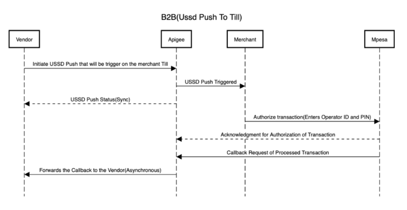
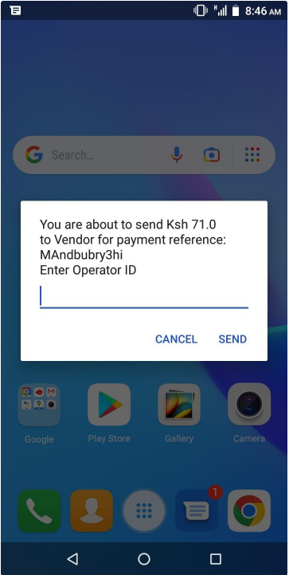
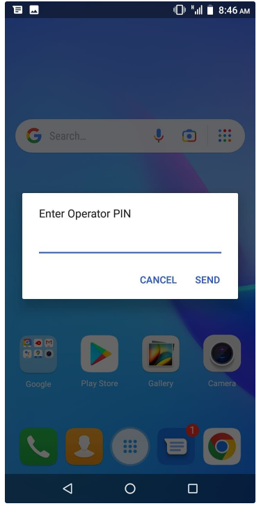
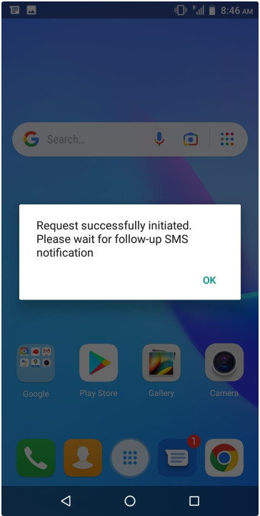
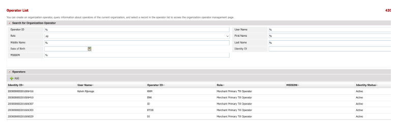

# B2BExpressCheckout
**Source:** https://developer.safaricom.co.ke/apis/B2BExpressCheckout

---

HomeAPIsDashboardMarketplaceFAQsMiniApps

Log Out

1. Discover APIs
2. /
3. B2B Express CheckOut

###### B2B Express CheckOut

By Safaricom

This API enables merchants to initiate USSD Push to till enabling their fellow merchants to pay from their own till numbers to the vendors paybill.

POST

https://sandbox.safaricom.co.ke/v1/ussdpush/get-msisdn

Use API

Get Started in 3 easy steps

Open Simulator

API DocumentationError

Overview

B2B(UssdPush to Till) is a product for enabling merchants to initiate USSD Push to Till enabling their fellow merchants to pay from their owned till numbers to the vendor's paybill.

**Authentication and Authorization**

Authentication happens at the Daraja(Apigee) layer by adding the product to your apps as explained in Daraja documentation where one obtains the consumer appKey and consumer appSecret.  
Below is a sequential diagram overview of the process:

1. The vendor initiates the USSD push, and the request is sent via Daraja.
2. Daraja communicates to the internal systems that send a stk push to the Merchant prompting Merchant to pay.
3. Merchant inserts Operator ID and Mpesa PIN for authentication and authorization.
4. Mpesa confirms details credits the vendor and debits the merchant.
5. Daraja sends a callback response to the sender.

#### Low-Level Architecture

Request Body

{

"primaryShortCode":"000001",

"receiverShortCode":"000002",

"amount":"100",

"paymentRef":"paymentRef",

"callbackUrl":"http://..../result",

"partnerName":"Vendor",

"RequestRefID":"{{random Unique Identifer For Each Request}}",

}

Request Parameter Definition

|  |  |  |  |
| --- | --- | --- | --- |
| **Name** | **Description** | **Type** | **Sample Values** |
| primaryShortCode | This is the debit party, the merchant’s till (organization sending money) shortCode/tillNumber. | Number | 000001 |
| receiverShortCode | This is the credit party, the vendor(payBill Account) receiving the amount from the merchant. | Number | 000001 |
| amount | Amount to be sent to vendor. | Number | 100 |
| paymentRef | This is a reference to the payment being made. This will appear in the text for easy reference by the merchant. | Alphanumeric | paymentRef |
| callbackUrl | The endpoint from the vendor system that will be used to send back the confirmation response once the transaction has taken place and the vendor is credited. | URL | http://..../result |
| partnerName | This is the organization Friendly name used by the vendor as known by the Merchant. | String | Vendor |
| RequestRefId | This is a random Unique Identifier sent by the vendor System. The value is what will be used to track the process across the different components. This will be generated at the Apigee level and the result returned in the acknowledgment. | AlphaNumeric | 550e8400-e29b-41d4-a716-446655440000 |

Response Body

Once the request is sent the vendor gets an acknowledgement of the sent request.  
Below is the acknowledgment response:

{

"code": "0",

"status":"USSD Initiated Successfully",

}

Response Parameter Definition

|  |  |  |  |
| --- | --- | --- | --- |
| **Name** | **Description** | **Type** | **Sample Values** |
| resultCode | Shows if the push was successful(0) or if it failed(Customer Cancelled). | Number | 4001,0 |
| resultDescription | Describe why the push was not finalized to the payment level. | AlphaNumeric | "User cancelled transaction" "The service request is processed successfully." |
| amount | The amount the vendor initiated to the merchant for Payment. | Number | 71 |
| requestId | The unique identifier of the request sent by the vendor. | String | "404e1aec-19e0-4ce3-973d-bd92e94c8021" |
| resultDescription | Describe why the push was not finalized to the payment level. | AlphaNumeric | "404e1aec-19e0-4ce3-973d-bd92e94c8021" |
| status | Status of the Transaction(Success/Failed). Complements the resultCode. | String | "SUCCESS" |
| transactionId | Mpesa Receipt No of the transaction. Only applicable if the transaction is successful. | AlphaNumeric | "RDQ01NFT1Q" |

Merchant Input Details

On a successful USSD Push trigger to the merchant, The debit party gets a prompt as shown in the below pictures.  
The values in the braces in the following text are from the vendor system.  
You are about to send Ksh {{amount}} to {{Vendor Friendly Name}} for payment reference: {{AccountNumber/BillReference}}.

1. Merchants are prompted to enter their operator ID.  
   
2. Next step, they are prompted to enter their operator PIN.  
   
3. Vendor Prompted to accept the amount.  
   
4. The merchant gets an acknowledgment they’ll receive a text once done.  
   

**USSD Fail Callback Response**  
In case the USSD Push Acknowledgement was a fail, the vendor gets a callback sent to the callback URL.  
**Mpesa Callback Response**  
If successful(USSD Push Acknowledgement), the customer-inserted - OperatorId, PIN, and Confirmation to Pay, Mpesa transactions go forward, and on success/failure, the vendor gets a callback.

USSD Callback Response

//Cancelled

{

"resultCode":"4001",

"resultDesc":"User cancelled transaction",

"requestId":"c2a9ba32-9e11-4b90-892c-7bc54944609a",

"amount":"71.0",

"paymentReference":"MAndbubry3hi",

}

//Successful

{

"resultCode":"0",

"resultDesc":"The service request is processed successfully.",

"amount":"71.0",

"requestId":"404e1aec-19e0-4ce3-973d-bd92e94c8021",

"resultType":"0",

"conversationID":"AG\_20230426\_2010434680d9f5a73766",

"transactionId":"RDQ01NFT1Q",

"status":"SUCCESS",

}

Failed Result Parameter Definition

|  |  |  |  |
| --- | --- | --- | --- |
| **Name** | **Description** | **Type** | **Sample Values** |
| Result | The root parameter encloses the entire result message. | JSON Object | "Result":{ } |
| ConversationId | This is a global unique identifier for the transaction request returned by the M-Pesa upon successful request submission. | String | 236543-276372-2 |
| OriginatorConversationId | This is a global unique identifier for the transaction request returned by the API proxy upon successful request submission. | String | AG\_2376487236\_126732989KJHJKH |
| ResultDesc | This is a message from the API that gives the status of the request processing and usually maps to a specific result code value. | String | The initiator information is invalid. |
| ResultType | This is a status code that indicates whether the transaction was already sent to your listener. Usual value is 0. | Number | 0 |
| ResultCode | This is a numeric status code that indicates the status of the transaction processing. 0 means success and any other code means an error occurred or the transaction failed. | Number | 2001 |
| ResultParameters | This is a JSON object that holds more details for the transaction  in a key-value format. | JSON Object | ResultParameters:{"ResultParameter":{"Key":"BOCompletedTime","Value":20200120164825}} |
| TransactionID | Unique M-PESA transaction ID for the payment request. A generic value is passed for certain failure scenarios. | String | OAK0000000 |
| ReferenceData | This JSON object holds more details for the transaction reference data. | JSON Object | "ReferenceData": {"ReferenceItem": []} |
| ReferenceItem | A JSON array within the that holds JSON Objects with additional transaction details |  | ReferenceItem": [{"Key": "BillReferenceNumber", "Value": "19008" }, {"Key": "", "Value": "" }]] |

Appendix

**Organization Operations**

The Mpesa platform accepts the creation of multiple operators on a registered Shortcode. The different operators have different roles and different rule profiles.   

An organization operator is linked to a phone number(preferred MSISDN) where they receive actions done on the shortcode/till.   
**NB:**The preferred MSISDN used by the operator acts on behalf of the organization. The operator will be prompted to enter a ***Merchant ID*** and ***Merchant PIN*** for operations involving Organizations.  

An organization can have multiple operators as shown in the screenshot below from Mpesa Web Portal

Transactions carried out for the shortcode/till from the operator are deducted from the till.  
The solution currently is limited to the operator whose phone number is under the ***Nominated Number*** under the Organization Details as configured in the Mpesa Web Portal.

**NB: Access to the Mpesa Web Portal Platform is given upon successful registration of a shortcode**.

Daraja 3.0

Daraja 3.0 is a web platform that offers access to Safaricom and M-PESA APIs that creates a bridge for payment integration to web and mobile apps. By connecting to our APIs, you open a world of possibilities to you and your clients. Together, we can transform lives.

Discover more

[Privacy Policy](/terms)

[Terms and Conditions](/terms)

Copyright@Safaricom PLC 2025

Ask Daraja about anything 😊

Logout of Daraja?

If you Logout, you will be required to Login again to access some features.

CancelLogout