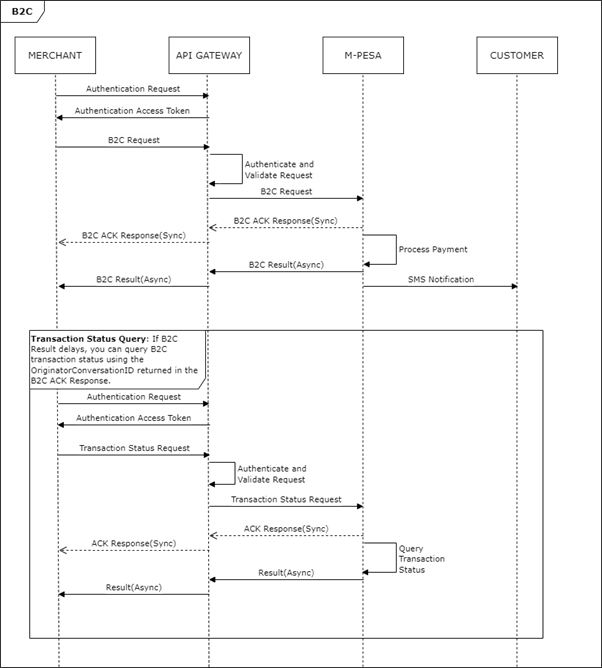
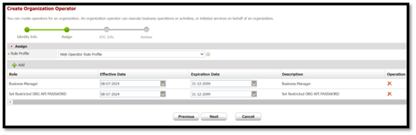

# BusinessToCustomer
**Source:** https://developer.safaricom.co.ke/apis/BusinessToCustomer

---

[](/)

HomeAPIsDashboardMarketplaceFAQsMiniApps

Log Out

1. Discover APIs
2. /
3. Business To Customer (B2C)


###### Business To Customer (B2C)

By Safaricom

Transact between an M-Pesa short code to a phone number registered on M-Pesa

POST

https://sandbox.safaricom.co.ke/mpesa/b2c/v3/paymentrequest

Use API

Get Started in 3 easy steps


Open Simulator

###### DOCUMENTATION

- Overview

- How It Works

- Getting Started

- Integration Steps

- Go live

- How To

- Support

## Overview

B2C API is used to make payments from a Business to Customers' number also known as Bulk Disbursements.

## How It Works

1. The Merchant (Partner) prepares and sends a payment request to the M-PESA B2C API endpoint.
2. The API Management Platform validates, authorizes, and authenticates the request, forwards it to M-PESA, and sends an acknowledgment to the Merchant.
3. M-PESA validates the request and initiator details, then processes the transaction.
4. M-PESA sends the transaction response to the Merchant via the specified callback URL.
5. The Customer receives an SMS notification confirming the payment

> **Note:** To go live and use the API in production, you must apply for a Bulk Disbursement Account and obtain a B2C Short Code or you convert your existing pay bill/till number to one account(can receive and disburse). Apply for the Bulk Disbursement Account/one account here <https://www.safaricom.co.ke/business/sme/m-pesa-payment-solutions>.

## Getting Started

### Prerequisites

1. Create a Daraja Account on [Safaricom Developer Portal](https://daraja.safaricom.co.ke/).
2. Create a sandbox app in the portal to get API credentials.
3. Retrieve Consumer Key & Consumer Secret from your sandbox app on [My Apps](https://daraja.safaricom.co.ke/dashboard/myapps).
4. **Test data:** Available on the simulator section.
5. **Initiator Username:** This is the API operator's username as set on the portal when the user was created. For Sandbox users, the username is already created and assigned to them and is available on the test credentials page as InitiatorName.
6. **Initiator Password:** This is the password assigned to the API operator after being created by the Business Administrator. For Sandbox users, this is available as InitiatorPassword on the test credentials page.  
   **Note:** The password should be limited to specific special characters such as #, &, %, and $. Other characters might cause issues, and the password may not be accepted. For example, using a `(` or `)` character will not be accepted. In addition, @ is not a special character on M-Pesa; it is treated as a normal character.
7. **Public Key Certificate:** This certificate is used to encrypt the Initiator's plaintext password for use in API calls. It is provided for both Sandbox and Production clients on the portal. You need to encrypt the password using your API language or use the test credentials section, which offers the capability to encrypt your password.
8. **Live M-PESA B2C shortcode, Paybill/till number:** For Go Live, you need a shortcode or number that can receive and disburse funds (one account) with Business Admin/Manager operators created.

### Good to Know

This API is asynchronous.

#### Get Auth Token

Devs gather here! You will first generate an access token to authenticate you to make the API call. See below generate access token [API](https://daraja.safaricom.co.ke/dashboard/apis?api=Authorization) here. We’ve also automated this on the simulate request section.

## Environments

| Environment | Description | URL |
| --- | --- | --- |
| Sandbox | Testing environment. | <https://sandbox.safaricom.co.ke/mpesa/b2c/v3/paymentrequest> |
| Production | Live environment for real transactions. | <https://api.safaricom.co.ke/mpesa/b2c/v3/paymentrequest> |

## Integration Steps

### Sequence Diagram



### Use Cases

* **Salary Payments**  
  Disbursement of employee wages from businesses to individual customer wallets or bank accounts.
* **Cashback Payments**  
  Automated refunds or rewards where a portion of money spent by customers is returned to their wallets as part of loyalty or promotional programs.
* **Promotional Payments**  
  Incentive payouts such as lottery winnings, betting rewards, or other campaign-based disbursements to customers.
* **Winnings**  
  Payouts from contests, games, or competitions where participants receive monetary rewards.
* **Financial Institutions Withdrawal of Funds**  
  Transfers initiated to move funds from a financial institution or digital wallet to a customer’s account or for cash-out purposes.
* **Loan Disbursements**  
  Distribution of approved loan amounts from lenders directly to borrowers’ wallets or bank accounts.

**Request Body**

```json
{ 
    "OriginatorConversationID": "600997_Test_32et3241ed8yu", 
    "InitiatorName": "testapi", 
    "SecurityCredential": "RC6E9WDxXR4b9X2c6z3gp0oC5Th ==", 
    "CommandID": "BusinessPayment", 
    "Amount": "10", 
    "PartyA": "600992", 
    "PartyB": "254705912645", 
    "Remarks": "remarked", 
    "QueueTimeOutURL": "https://mydomain.com/path", 
    "ResultURL": "https://mydomain.com/path", 
    "Occassion": "ChristmasPay" 
}
```

**Request Parameter Definition**

| Name | Description | Type | Optional | Sample Value |
| --- | --- | --- | --- | --- |
| OriginatorConversationID | Unique string generated by the merchant system for every B2C request to avoid double disbursement. You can use this ID to query the status of a transaction before making another disbursement. | String | No | 600997\_Test\_32et3241ed8yu |
| InitiatorName | Username of the API user created on the M-PESA portal. | String | No | johndoe |
| SecurityCredential | Encrypted password of the API user created on the M-PESA portal. | String | No | RC6E9WDx9X2c6z3gp0oC5Th== |
| CommandID | Transaction type used to identify the B2C transaction: - ***SalaryPayment***: Supports sending money to both registered and unregistered M-PESA customers (sending to unregistered numbers is no longer supported). - ***BusinessPayment***: Normal business to customer payment, supports only M-PESA registered customers. - ***PromotionPayment***: Promotional payment to customers. The M-PESA notification message is a congratulatory message. Supports only M-PESA registered customers. | String | No | BusinessPayment |
| Amount | Transaction amount. | Numeric | No | 11 |
| PartyA | B2C organization short code from which the money is sent. | Numeric | No | 600997 |
| PartyB | Customer’s mobile number to receive the money (12-digit MSISDN without the plus sign, e.g. 254705912645). | Numeric | No | 254705912645 |
| Remarks | Additional information sent with the request (2–100 characters). | String | No | Any string between 2 and 100 chars |
| QueueTimeOutURL | URL for notification if the payment request times out while awaiting processing. | URL | No | <https://mydomain.com/b2c/timedout> |
| ResultURL | URL where the payment gateway sends the result after processing the payment request. | URL | No | <https://mydomain.com/b2c/result> |
| Occassion | Additional information sent with the request (1–100 characters). | String | Yes | Any string between 1 and 100 chars |

**Response Body**

```json
{ 
    "ConversationID": "AG_20240706_20106e9209f64bebd05b", 
    "OriginatorConversationID": "600997_Test_32et3241ed8yu", 
    "ResponseCode": "0", 
    "ResponseDescription": "Accept the service request successfully." 
}
```

**Response Parameter Definition**

| Name | Description | Parameter Type | Sample Value |
| --- | --- | --- | --- |
| OriginatorConversationID | The unique request ID for tracking a transaction | Alpha-Numeric | Alpha-Numeric String of less than 20 characters e.g.: 1236-7134259-1 |
| ConversationID | The unique request ID returned my M-PESA for each request made | Alpha-Numeric | Alpha Numeric String of less than 20 characters e.g.: AG\_20210709\_1234409f86436c583e3f |
| ResponseCode | The numeric status code indicates the status transaction processing. 0 means success and any other code means an error occurred or the transaction failed. | Number | 0 or 1 or 2001 or 21 |
| ResponseDescription | Response description message | String | Accept the service request successfully |

**Callback payload**
After processing the B2C transaction on M-PESA, you get feedback via the ResultURL which you need to have specified beforehand in the B2C request.

```json
{
    "Result": {
        "ResultType": 0,
        "ResultCode": 0,
        "ResultDesc": "The service request is processed successfully.",
        "OriginatorConversationID": "53e3-4aa8-9fe0-8fb5e4092cdd3533373",
        "ConversationID": "AG_20240706_2010364430d9bbdaf872",
        "TransactionID": "SG632NMUAB",
        "ResultParameters": {
            "ResultParameter": [
                {
                    "Key": "TransactionAmount",
                    "Value": 10
                },
                {
                    "Key": "TransactionReceipt",
                    "Value": "SG632NMUAB"
                },
                {
                    "Key": "ReceiverPartyPublicName",
                    "Value": "254705912645 - NICHOLAS JOHN SONGOK"
                },
                {
                    "Key": "TransactionCompletedDateTime",
                    "Value": "06.07.2024 22:48:52"
                },
                {
                    "Key": "B2CUtilityAccountAvailableFunds",
                    "Value": 8959269.60
                },
                {
                    "Key": "B2CWorkingAccountAvailableFunds",
                    "Value": 1199371.00
                },
                {
                    "Key": "B2CRecipientIsRegisteredCustomer",
                    "Value": "Y"
                },
                {
                    "Key": "B2CChargesPaidAccountAvailableFunds",
                    "Value": -1980.00
                }
            ]
        },
        "ReferenceData": {
            "ReferenceItem": {
                "Key": "QueueTimeoutURL",
                "Value": "https://internalsandbox.safaricom.co.ke/mpesa/b2cresults/v1/submit"
            }
        }
    }
}
```

**Sample Unsuccessful Callback Payload**

```json
{
    "Result": {
        "ResultType": 0,
        "ResultCode": 2001,
        "ResultDesc": "The initiator information is invalid.",
        "OriginatorConversationID": "53e3-4aa8-9fe0-8fb5e4092cdd3544366",
        "ConversationID": "AG_20240707_201062f6f6f5804f7a33",
        "TransactionID": "SG722NMVXQ",
        "ReferenceData": {
            "ReferenceItem": {
                "Key": "QueueTimeoutURL",
                "Value": "https://internalsandbox.safaricom.co.ke/mpesa/b2cresults/v1/submit"
            }
        }
    }
}
```

**Results Parameter Definition**

The following parameters are returned in the callback payload, whether the request was successful or not:

| Parameter | Description | Type | Optional | Sample Value |
| --- | --- | --- | --- | --- |
| Result | Root object for the entire result message. | JSON Object | No | { ... } |
| ResultType | Status code indicating if the transaction was sent to your listener. Usually 0. | Numeric | No | 0 |
| ResultCode | Status code for transaction processing. 0 means success; any other code means failure. | String | No | 0 |
| ResultDesc | Message describing the status of request processing. | String | No | The service request is processed successfully. The initiator information is invalid. |
| OriginatorConversationID | Unique identifier for the transaction request, returned by the API proxy. | String | No | 53e3-4aa8-9fe0-8fb5e4092cdd3544366 |
| ConversationID | Unique identifier for the transaction request, returned by M-PESA. | String | No | AG\_20240707\_20106f7a33 |
| TransactionID | Unique M-PESA transaction ID for each payment request. Also sent to customer via SMS. | String | No | SG722NMVXQ` |

Additional parameters are returned for a successful request, under ResultParameters:

| Parameter | Description | Type | Optional | Sample Value |
| --- | --- | --- | --- | --- |
| ResultParameters | Object holding more transaction details. | JSON Object | Yes | { "ResultParameters": { ... } } |
| ResultParameter | Array within ResultParameters holding additional transaction details as objects. | JSON Array | Yes | [ { ... }, ... ] |
| TransactionAmount | Amount transacted. Also returned under ResultParameter. | Numeric | Yes | 10 |
| TransactionReceipt | Unique M-PESA transaction ID for the payment request. | String | Yes | SG722NMVXQ |
| ReceiverPartyPublicName | Name and phone number of the customer who received the payment. | String | Yes | 254705912645 - NICHOLAS JOHN SONGOK |
| TransactionCompletedDateTime | Date and time the transaction completed on M-PESA. | String | Yes | 06.07.2024 22:48:52 |
| B2CUtilityAccountAvailableFunds | Available balance of the Utility account under the B2C shortcode used. | Decimal | Yes | 8959269.60 |
| B2CWorkingAccountAvailableFunds | Available balance of the Working account under the B2C shortcode used. | Decimal | Yes | 1199371.00 |
| B2CRecipientIsRegisteredCustomer | Indicates if the customer is a registered M-PESA customer. | Character | Yes | "Y" for Yes, "N" for No |
| B2CChargesPaidAccountAvailableFunds | Available balance of the Charges Paid account under the B2C shortcode used. | Decimal | Yes | -1980.00 |

Reference data parameters:

| Parameter | Description | Type | Optional | Sample Value |
| --- | --- | --- | --- | --- |
| ReferenceData | Object holding additional details for the request. | JSON Object | Yes | { "ReferenceData": { ... } } |
| ReferenceItem | Object within ReferenceData holding more transaction details. | JSON Object | Yes | { "ReferenceItem": { ... } } |

### Sample Error Response

```json
{
    "requestId": "1c5b-4ba8-815c-ac45c57a3db01469899",
    "errorCode": "500.002.1001",
    "errorMessage": "Duplicate OriginatorConversationID."
}
```

| Name | Description | Sample | Type |
| --- | --- | --- | --- |
| requestId | Unique identifier assigned by API gateway. | 30764-19833054-1 | String |
| errorCode | Unique error code. | 401.001 | String |
| errorMessage | A descriptive message of failure. | Bad Request - Invalid amount | String |

## Response Codes

| Response Code | Response Description |
| --- | --- |
| 0 | Success |

## Result Codes

| ResultCode | ResultDesc | Explanation |
| --- | --- | --- |
| 0 | The service request is processed successfully. | The B2C transaction has been processed successfully on M-PESA. |
| 1 | The balance is insufficient for the transaction. | The B2C account does not have enough money in its utility account to complete the transaction requested. |
| 2 | Declined due to limit rule | The amount provided in the request is smaller than the allowed B2C transaction amount. |
| 3 | Declined due to limit rule: greater than the maximum transaction amount. | The amount provided in the request is greater than the allowed B2C transaction amount. |
| 4 | Declined due to limit rule: would exceed daily transfer limit | For the business organization, the daily transfer limit is very high; this rule is more likely to apply to the customer, where the customer daily transfer amount limit is currently Ksh 500,000. |
| 8 | Declined due to limit rule: would exceed the maximum balance. | Continuing to process the requested transaction would exceed the maximum customer account balance limit (currently Ksh 500,000). |
| 11 | The DebitParty is in an invalid state. | The B2C account is not active. |
| 21 | The initiator is not allowed to initiate this request | The API user used in the request has no ORG B2C API initiator role required to successfully initiate B2C request. |
| 2001 | The initiator information is invalid. | The API user credentials provided in the request are invalid. This can be: - Wrong API user username. - Wrong API user password encrypted. - Wrong algorithm or certificate used for API user password encryption. |
| 2006 | Declined due to account rule: The account status does not allow this transaction. | The B2C account is not active. |
| 2028 | The request is not permitted according to product assignment. | The PartyA short code specified in the request has no permission to perform B2C payments. |
| 2040 | Credit Party customer type (Unregistered or Registered Customer) can't be supported by the service. | The customer is not registered. |
| 8006 | The security credential is locked | Indicates that the password for the API user is locked. The Business Administrator can unlock it. |
| SFC\_IC0003 | The operator does not exist. | The phone number provided in the request is invalid or does not exist on M-PESA. |

## Next steps

### TESTING

***Testing time Devs***

### Option 1: Daraja Simulator

Create a new test app under apps on the main nerve bar, select transaction status product. Once app is successfully created the simulator is automated to pick app credentials (Consumer key and Consumer Secret) and predefined test data, you can hit the simulate button.


### Option 2: Postman

Use the credentials to generate access token using the below endpoint.

* Sandbox: `https://sandbox.safaricom.co.ke/mpesa/transactionstatus/v1/query`
* Production: `https://sandbox.safaricom.co.ke/mpesa/transactionstatus/v1/query`
  Initiate Transaction status using the above transaction status request body. Download the availed postman collection. Ensure to replace the parameters with actual credentials.

### GO LIVE

**Time to launch, here Dev you need help from the business teams no more Rambo stunts behind the keyboard. Some collaboration will do; a handshake to the business team in the morning it is. Wait! You can act Rambo if you are both the Business and Dev**

We’ve already tested, and finished development now attach the integration to a live pay bill/till number. Navigate to GO LIVE tab. Fill in the below fields with live data. We require a short code of a live pay bill or till number, the organization name and an M-PESA admin/manager username to successfully go live. Kindly visit our how-to section for more information on m-pesa org portal access and user creation.


Upon successful go live, production endpoints will be sent to developer email and the test sandbox app will be moved to production with production consumer key and secrets. Below is how to see the production app.

**We’ve successfully deployed dev congratulations we are now live!**

## How To

**Access to the M-PESA Organization Portal and create Users**

The M-PESA organization portal is a platform designed for businesses and organizations to manage their financial transactions through the M-PESA services.

The portal offers various features for businesses, including:

1. Transaction Management: Monitor and manage transactions, generate reports, and reconcile accounts.
2. Account Management: Manage multiple user accounts with different access levels within the organization.
3. Bulk Payments: Facilitate bulk payments to employees, suppliers, and other beneficiaries efficiently.

**Access to the M-PESA Organization Portal**


To access the Organization portal (<https://org.ke.m-pesa.com/orglogin.action>), you need to have a Business Administrator role created under your business short code (Pay Bill/ Till).

The first step before getting access, is to ensure the settlement option set to your short code is Bank via a Head Office application.

To make an application for a Head Office for your short code/Store Number kindly contact [M-PESABusiness@Safaricom.co.ke](mailto:M-PESABusiness@Safaricom.co.ke) where they will provide you with the forms to be filled.

After Head Office is created the [M-PESABusiness@Safaricom.co.ke](mailto:M-PESABusiness@Safaricom.co.ke) will also guide on the creation of the Business Administrator (username).

**How to login to M-PESA Organization Portal For the first time:**

1. Launch the link from any of the browsers: <https://org.ke.m-pesa.com>.
2. Enter the Short code which is Bulk payment number.
3. Enter the Business Administrator username received

To make an application for a Head Office for your short code/Store Number kindly contact [M-PESABusiness@Safaricom.co.ke](mailto:M-PESABusiness@Safaricom.co.ke) where they will provide you with the forms to be filled.
After Head Office is created, the [M-PESABusiness@Safaricom.co.ke](mailto:M-PESABusiness@Safaricom.co.ke) will also guide on the creation of the Business Administrator (username).

## How to login to M-PESA Organization Portal For the first time:

1. Launch the link from any of the browsers: <https://org.ke.m-pesa.com>.
2. Enter the Short code which is Bulk payment number.
3. Enter the Business Administrator username received on email.
4. Enter the first-time password received on the same email – the Password is case-sensitive (full stop is not part of the password).
5. Enter the Verification Code displayed then click login, on the Next Page.
6. Enter OTP to proceed to the change password page.
7. Enter the first-time password on email, then proceed to set a new password.
8. Confirm password, security question, and security answer one and two which are mandatory.
9. The Password must meet the password rules as instructed.
10. Submit to successfully activate the Business Administrator account.
11. After activation, you will only be entering your username, shortcode, and password verification code and entering the OTP received via SMS to log in.

## Account Types in C2B Organization

1. **MMF/WORKING/M-PESA ACCOUNT FOR ORGANIZATION**

   * When an organization wants to make a business withdrawal, the funds are transferred to this account before the withdrawal request is made.
2. **UTILITY ACCOUNT**

   * Payments from customers are credited into the utility account.
3. **CHARGES PAID ACCOUNT**

   * For payments received from customers, depending on the tariff, a charge is levied on the Organization or is split between the organization and the customer. The charges paid account is debited and always accrues a negative balance which has to be settled before an organization can make a withdrawal request.
4. **ORGANIZATION SETTLEMENT ACCOUNT**

   * This account does the calculations for the organization operator when s/he initiates a revenue settlement. This account settles the charges paid account and then moves the balance from the Utility Account to the MMF account automatically. You will notice that the transaction type “Move funds from Utility to MMF” is no longer available as the revenue settlement process takes care of this.

## Various Roles under the portal

### Business Administrator role

The Business Administrator role is crucial for managing and overseeing user activities within the portal.

**Responsibilities of a Business Administrator:**

1. Create other system users and give them roles depending on what he/she wants them to do within the portal. The roles include:
   * A Business Web Operator who can initiate transactions, access statements, and check balance.
   * A business manager.
   * A Business Auditor – View Only/ Read Only Rights.
2. Not able to view transactions.
3. User created by Safaricom ([M-PESABusiness@Safaricom.co.ke](mailto:M-PESABusiness@Safaricom.co.ke)).

### Business Manager

The Business manager approves transactions, checks balances, and access statements.

**Responsibilities of a Business Manager:**

1. The user can View statements.
2. The user can initiate transactions.
3. The user can Approve/reject other transactions.
4. The user can withdraw funds from M-PESA.

**Proceed as below to create a business manager:**

1. Log in the Organization portal as the Business administrator.
2. Select operators.


3. Then click the add option.
4. It will take you to a new page where you will enter the username of the operator.
5. Select access channel as Web.


6. Then select web profile default rule profile.
7. Then assign role...Business Manager and Set Restricted ORG API PASSWORD.



8. Enter the KYC information of the operator then submit.

### API user creation

**Proceed as below to create an API Operator:**

1. Log in as the Business administrator.
2. Select operators.


3. Then click the add option.
4. It will take you to a new page where you will enter the username of the API initiator.
5. Select access channel as API.
6. Then select web profile default rule profile.
7. Then assign role...look for the ORG B2C API initiator, Balance Query ORG API, Transaction Status query ORG API roles.


8. Enter the KYC information of the operator then submit.

**Here is how to set the password for the API user:**

1. Login as User with the Set Restrict Password Role i.e. The Business Manager.


2. Click on My Functions, Then Operator Management.
3. Enter the API username to search after it populates the API user, At the end click on operations.
4. Then click on set password avoid such (@ or.) in the setting of this password.


### Various API roles:

| API | API Role Assignment |
| --- | --- |
| B2C | ORG B2C API Initiator. |
| Business Pay Bill | Business Paybill Org API initiator. |
| Business Buy Goods | Business Buy Goods Org API initiator. |
| Transaction Status | Transaction Status query ORG API. |
| Reversals | Org Reversals Initiator. |
| Tax Remittance | Tax Remittance to KRA API. |
| Set Password role | Set Restricted ORG API PASSWORD. |

## How to apply for a live pay bill number/till number or B2C Account

Apply here: [M-PESABusiness@Safaricom.co.ke](mailto:M-PESABusiness@Safaricom.co.ke)

## Support

### Chatbot

Developers can get instant responses using the Daraja Chatbot for both development and production support.

### Production Issues & Incident Management

For production support and incident management, use:

* **Incident Management Page:** Visit the [Incident Management](https://daraja.safaricom.co.ke/dashboard/incidentmanagement) page.
* **Email:** Reach out to API support at [apisupport@safaricom.co.ke](mailto:apisupport@safaricom.co.ke).

### Frequently Asked Questions (FAQs)

1. **Why am I not receiving callbacks on my B2C ResultURL?**  
   Ensure your callback endpoint (ResultURL) is publicly accessible over the internet. Use a valid IP address or domain name, and confirm your server is reachable.
2. **What should I do if I encounter an invalid access token error?**

   * Check that your access token has not expired (tokens expire hourly).
   * Ensure you are using the correct consumer key and consumer secret to generate the token.
3. **Can I use my actual B2C short code on the Daraja portal simulator?**  
   No. The simulator supports only sandbox test short codes. Use your application or a REST client (e.g., Postman) for live short code testing.
4. **How do I know if the B2C request is successful?**  
   The B2C API is asynchronous. You receive an acknowledgement immediately, but the actual transaction result is sent later to your specified ResultURL. A successful transaction has ResultCode 0.
5. **Is there a test environment for B2C API?**  
   Yes. Use the sandbox environment and test credentials provided on the Daraja developer portal. You can test via the simulator, your code, or any REST client.
6. **Why am I getting a balance insufficient error, yet I have money in my B2C account?**  
   B2C transactions debit the Utility account. Ensure sufficient funds are available in the Utility account, not just the MMF/Working account.
7. **How do I move funds from MMF/Working account to Utility account for B2C disbursement?**  
   Log in to the M-PESA portal as a Business Web Operator:

   * Go to My Functions > Initiate Transaction
   * Select "Business Services – Move Funds from MMF Account to Utility Account"
   * Enter required details and submit
   * Another operator must approve the transaction under My Tasks > Group Task  
     This can also be automated via the B2B API.
8. **Can I automate the funds transfer from MMF/Working account to Utility account?**  
   Yes. Use the B2B API with CommandID ***BusinessTransferFromMMFToUtility***. Contact [apisupport@safaricom.co.ke](mailto:apisupport@safaricom.co.ke) for whitelisting.
9. **What are the minimum and maximum limits for B2C transaction amounts?**

   * Minimum: Ksh 10
   * Maximum per transaction: Ksh 250,000
   * Maximum customer account balance: Ksh 500,000
   * Maximum daily value: Ksh 500,000
10. **Which API role is required for B2C requests?**  
    Assign the ***ORG B2C API initiator*** role to your API user (done by the Business Administrator).
11. **My API user is showing pending active status; how do I activate it?**  
    The API user must have their password set by a user with the Set ***Restricted ORG API PASSWORD*** role. Once set, the status changes to active.
12. **Why am I getting "initiator information is invalid" error?**  
    This means the API user credentials are incorrect. Check:

    * Username
    * Encrypted password
    * Encryption algorithm/certificate (use the tool on the developer portal)
13. **Why am I getting "security credential is locked" error?**  
    Multiple failed login attempts lock the API user password. The Business Administrator can unlock it on the M-PESA portal. Ensure the correct password is used.
14. **How do I resolve "Invalid API call as no apiproduct match found" error?**

    * For production, ensure the B2C product is enabled on your Daraja app.
    * Verify you are calling the correct API endpoint.
15. **Do I need a passkey for B2C?**  
    No. Passkey is only required for M-PESA Express/STK Push API.
16. **Why is the B2C product missing when I try to Go Live with my pay bill?**  
    Your pay bill may not have B2C permissions. You need a B2C or one account short code. Apply via <https://m-pesaforbusiness.co.ke/>.
17. **Can I reverse a B2C transaction using the Reversal API?**  
    No. B2C reversals are not supported via API and must be done manually on the M-PESA portal.
18. **Why am I getting "Bad Request - Invalid InitiatorName" error?**  
    Possible causes:

    * Wrong Content-Type (should be application/json)
    * Incorrect parameter name
    * Invalid or missing InitiatorName value
19. **Can I have both B2C and C2B on my Daraja application?**  
    Yes, if both functionalities are enabled for your short code.
20. **Which operator can create an API user?**  
    Only the Business Administrator can create API users. Any web user with the Set Restricted ORG API PASSWORD role can set the password.
21. **Do I need to generate the security credential for every B2C request?**  
    No. You can reuse the same security credential for multiple requests.
22. **Do I need to manually approve B2C requests initiated via API?**  
    No. Manual approval is not required for API-initiated B2C requests.
23. **Can I check B2C transaction status using the Transaction Status Query API?**  
    Yes. Use the OriginatorConversationID or the M-PESA Receipt Number.
24. **Is there an API for moving money from a pay bill number to a B2C short code?**  
    Yes. Use the B2C Account Top Up API to move funds from your pay bill’s Working account to the B2C Utility account. See [B2C Account Top Up API documentation](https://developer.safaricom.co.ke/APIs/B2CAccountTopUp).

Daraja 3.0

Daraja 3.0 is a web platform that offers access to Safaricom and M-PESA APIs that creates a bridge for payment integration to web and mobile apps. By connecting to our APIs, you open a world of possibilities to you and your clients. Together, we can transform lives.

Discover more

[Privacy Policy](/terms)

[Terms and Conditions](/terms)

Copyright@Safaricom PLC 2025

Ask Daraja about anything 😊


Logout of Daraja?

If you Logout, you will be required to Login again to access some features.

CancelLogout