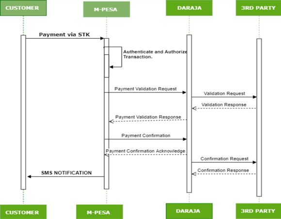
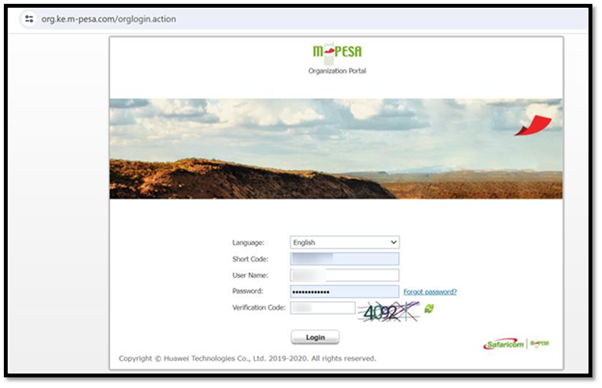

# CustomerToBusiness
**Source:** https://developer.safaricom.co.ke/apis/CustomerToBusiness

---

[](/)

HomeAPIsDashboardMarketplaceFAQsMiniApps

Log Out

1. Discover APIs
2. /
3. Customer To Business (C2B)


###### Customer To Business (C2B)

By Safaricom

Register URL for Validation/Confirmation and Simulate transaction.

POST

https://sandbox.safaricom.co.ke/mpesa/c2b/v2/registerurl

Use API

Get Started in 3 easy steps


Open Simulator

###### DOCUMENTATION

- Overview

- How It Works

- Getting Started

- Integration Steps

- Go live

- How To

- Support

## Overview

The Customer to Business (C2B) API, also known as the Register URL API, enables merchants to receive notifications for successful payments to their Paybill or Till numbers. Funds originate from the customer wallet and are transferred to the merchant’s short code. Payments can be initiated via SIM Toolkit, Mpesa App, Safaricom App, USSD, NI Push API, or Dynamic QR Code API.

The C2B API allows you to register callback URLs for payment notifications:

* **Validation URL**: Used when a merchant needs to validate payment details before accepting (e.g., verifying an account number).
* **Confirmation URL**: Receives payment notification after successful completion.

> **Note:** C2B Transaction Validation is optional and must be activated by emailing [apisupport@safaricom.co.ke](mailto:apisupport@safaricom.co.ke) or [M-pesabusiness@safaricom.co.ke](mailto:M-pesabusiness@safaricom.co.ke).

## How It Works

1. Customer initiates payment to a Paybill or Till number.
2. M-PESA validates the request internally.
3. M-PESA checks if External Validation is enabled for the Paybill.
4. If enabled:
   * Sends a Validation request to the registered Validation URL.
   * Merchant system validates and responds (within ~8 seconds).
   * M-PESA processes the transaction based on the response.
   * If default action is "Completed", sends a Confirmation request to the Confirmation URL.
   * If default action is "Cancelled", cancels the transaction.
5. If External Validation is disabled, M-PESA completes the transaction and sends a Confirmation request.
6. If unable to reach the merchant’s endpoint, M-PESA uses the default action value.
7. If no URLs are registered, M-PESA completes the request.
8. SMS notifications are sent to both customer and merchant.
9. For failed notifications, use Pull Transaction API or check the [M-PESA Org portal](https://org.ke.m-pesa.com/login.action).

**URL Requirements:**

* Use publicly available IP addresses or domain names.
* Production URLs must be HTTPS; Sandbox allows HTTP.
* Avoid keywords like M-PESA, Safaricom, exe, exec, cmd, SQL, query, etc., in URLs.
* Do not use public URL testers (e.g., ngrok, mockbin, requestbin) in production.

> **Note:** On the sandbox, you are free to register your URLs multiple times or even overwrite the existing ones. In the production environment, this is a one-time API call that registers your validation and confirmation URLs to have them changed you can delete them on the URL management tab under self-service and re-register using register URL API, you can also email us at [apisupport@safaricom.co.ke](mailto:apisupport@safaricom.co.ke) for assistance.

> **Note:** As you set up the default value, the words "Cancelled/Completed" must be in sentence case and well-spelled.

## Getting Started

### Prerequisites

* Create a Daraja Account on Safaricom Developer Portal.
* Create a sandbox app to get API credentials.
* Retrieve Consumer Key & Consumer Secret.
* Use test data from the simulator section.
* Have a live M-PESA Paybill/Till number with Business Admin/Manager operators for Go Live.

### Good to Know

* The API is asynchronous.
* Can be consumed over the internet, VPN, or Multiprotocol Switch.

#### Get Auth Token

Generate an access token to authenticate API calls. See [Authorization API](https://daraja.safaricom.co.ke/dashboard/apis?api=Authorization).

## Environments

| Environment | Description | Register URLs | Simulate C2B Transactions |
| --- | --- | --- | --- |
| Sandbox | Testing | <https://sandbox.safaricom.co.ke/mpesa/c2b/v2/registerurl> | <https://sandbox.safaricom.co.ke/mpesa/c2b/v2/simulate> |
| Production | Live | <https://api.safaricom.co.ke/mpesa/c2b/v2/registerurl> | <https://api.safaricom.co.ke/mpesa/c2b/v2/simulate> |

> **NB:** Simulation is not supported on production. MPESA payments should be done via Mpesa App, USSD or sim toolkit.

## Integration Steps

### Sequence Diagram




### Use Cases

Automate delivery of M-PESA payment notifications to applications, websites, and ERP systems for real-time updates.

### Request Body

**Register URLs**

```json
{
  "ShortCode": "600984",
  "ResponseType": "Either Cancelled or Completed",
  "ConfirmationURL": "your confirmation URL",
  "ValidationURL": "your validation URL"
}
```

**Simulate Transactions**

```json
{
  "ShortCode": 600984,
  "CommandID": "Either CustomerBuyGoodsOnline or CustomerPayBillOnline",
  "Amount": 1,
  "Msisdn": 254708374149,
  "BillRefNumber": "Account reference for Customer paybills and null for customer buy goods"
}
```

### Request Parameter Definition

| Name | Description | Type | Sample Values |
| --- | --- | --- | --- |
| ValidationURL | This is the URL that receives the validation request from the API upon payment submission. The validation URL is only called if the external validation on the registered shortcode is enabled. (By default External Validation is disabled). | URL | <https://ip/domain:port/path> |
| ConfirmationURL | This is the URL that receives the confirmation request from API upon payment completion. | URL | <https://ip/domain:port/path> |
| ResponseType | This parameter specifies what is to happen if for any reason the validation URL is not reachable. Note that, this is the default action value that determines what M-PESA will do in the scenario that your endpoint is unreachable or is unable to respond on time. Only two values are allowed: Completed or Cancelled. Completed means M-PESA will automatically complete your transaction, whereas Cancelled means M-PESA will automatically cancel the transaction, in the event M-PESA is unable to reach your Validation URL. | String | Completed, Cancelled |
| ShortCode | Usually, a unique number is tagged to an M-PESA pay bill/till number of the organization. | Numeric | 600996 |
| CommandID | This is a field used to define the type of transaction being simulated. Either “CustomerBuyGoodsOnline” to signify a payment to a till number or “CustomerPayBillOnline” to signify a payment to a paybill number. | String | CustomerBuyGoodsOnlineCustomerPayBillOnline |
| Amount | This parameter is a number that indicates the amount to be transacted. | Numeric | 10 |
| Msisdn | This is the phone number from which the funds will be debited. For testing use the provided number. | Numeric | 254708374149 |
| BillRefNumber | This is the account reference number provided for payments to paybill numbers, usually null for till number. | String | "Test Ref" |

### Response Body

**Simulate Response**

```json
{
  "OriginatorCoversationID": "53e3-4aa8-9fe0-8fb5e4092cdd3405976",
  "ResponseCode": "0",
  "ResponseDescription": "Accept the service request successfully."
}
```

**Register URLs Response**

```json
{
  "OriginatorCoversationID": "6e86-45dd-91ac-fd5d4178ab523408729",
  "ResponseCode": "0",
  "ResponseDescription": "Success"
}
```

### Response Parameter Definition

| Name | Description | Type | Sample Values |
| --- | --- | --- | --- |
| OriginatorCoversationID | Global unique identifier for the transaction request returned by the API proxy upon successful request submission. | Alphanumeric | Alpha-numeric string, fewer than 20 characters |
| ResponseCode | Indicates whether Mobile Money accepts the request or not. | Alphanumeric | 0 |
| ResponseDescription | Status of the request. | String | Success |

> **NB:** Before including any API request to register URLs, you must first generate an access token from the Authorization API. This token is required to successfully make API calls.

Once you have registered your URLs as described above, a C2B API payment transaction is initiated by the customer during payment. You can use the simulator to preview how the request will look; no development is needed on your side for this part.

Upon successful payment, M-PESA posts the payment details to your confirmation and validation URLs as described in the response body below.

## Callback Payload

**Validation Request:**  
The validation request is received only by partners who have enabled the External Validation feature on their PayBill or BuyGoods (Till Number) and require payment validation before M-PESA completes the transaction. You will first receive a validation request at your Validation URL.

The confirmation and validation results posted to your URLs after payment will have one of the following structures:

**Masked version:**

```json
{
  "TransactionType": "Pay Bill",
  "TransID": "RKL51ZDR4F",
  "TransTime": "20231121121325",
  "TransAmount": "5.00",
  "BusinessShortCode": "600966",
  "BillRefNumber": "Sample Transaction",
  "InvoiceNumber": "",
  "OrgAccountBalance": "25.00",
  "ThirdPartyTransID": "",
  "MSISDN": "2547 ***** 126",
  "FirstName": "NICHOLAS",
  "MiddleName": "",
  "LastName": ""
}
```

### Callback Parameter Definition

| Name | Description | Type | Sample Values |
| --- | --- | --- | --- |
| TransactionType | The transaction type specified during the payment request. | String | Buy Goods or Pay Bill |
| TransID | Unique M-Pesa transaction ID for every payment request. Sent in both callback messages and confirmation SMS to the customer. | Alpha-numeric | LHG31AA5TX |
| TransTime | Timestamp of the transaction in the format YEAR+MONTH+DATE+HOUR+MINUTE+SECOND (YYYYMMDDHHMMSS). Each part should be at least two digits except the year (four digits).e.g. 20170813154301 | Time | YYYYMMDDHHmmss |
| TransAmount | Amount transacted (numeric value), money paid by the customer to the Shortcode. Only whole numbers are supported. | Numeric | 100 |
| BusinessShortCode | Organization's shortcode (Paybill or Buygoods - a 5 to 6-digit account number) used to identify an organization and receive the transaction.e.g. 654321 | String | Shortcode (5 to 6 digits) |
| BillRefNumber | Account number for which the customer is making the payment. Applicable only to Customer PayBill Transactions. | String | Alpha-numeric, up to 20 chars |
| OrgAccountBalance | Current utility account balance of the payment-receiving organization shortcode. Blank for validation requests; for confirmation, represents new balance after payment. | Decimal | 30671 |
| ThirdPartyTransID | Transaction ID that the partner can use to identify the transaction. For validation requests, partner can respond with ThirdPartyTransID, which is sent back with confirmation notification. | String | 1234567890 |
| MSISDN | Masked number of the customer making the payment. | String | 2547 \*\*\*\*\* 126 |
| FirstName | Customer's first name as per the M-Pesa register. Can be empty. | String | John |
| MiddleName | Customer's middle name as per the M-Pesa register. Can be empty. | String | null |
| LastName | Customer's last name as per the M-Pesa register. Can be empty. | String | null |

## Response Codes

**Validation Response**

* After receiving the validation request, you are required to process it and respond to the API call and inform M-PESA either to accept or reject the payment. To accept, you send the below JSON making sure the value of ResultCode is 0 (zero), but the value of ResultDesc is Accepted.

  ```json
  {
    "ResultCode": "0",
    "ResultDesc": "Accepted"
  }
  ```
* To reject a transaction, you send the same JSON above, but with the ResultCode set as C2B00011 (or any other value from the error table below), BUT NOT 0. The ResultDesc should be set as Rejected as shown below:

  ```json
  {
    "ResultCode": "C2B00011",
    "ResultDesc": "Rejected"
  }
  ```

**Result Codes**

* When rejecting transactions, responding with the ResultCodes below to the validation callback ensure that the customers receive a more appropriate message.

| ResultCode | ResultDesc |
| --- | --- |
| C2B00011 | Invalid MSISDN |
| C2B00012 | Invalid Account Number |
| C2B00013 | Invalid Amount |
| C2B00014 | Invalid KYC Details |
| C2B00015 | Invalid Short code |
| C2B00016 | Other Error |

## Error Codes

| HTTP Code | Error Message | Possible Cause | Mitigation |
| --- | --- | --- | --- |
| 500 | 500.003.1001 Internal Server Error | Server failure. | Make sure everything on your side is correctly set up as per the API and you are calling the correct endpoints plus your server is running as expected. |
| 500 | 500.003.1001 Urls are already registered. | There is an existing URL registered | If you want to change, request for deletion of the existing and re-register. |
| 400 | 400.003.01 Invalid Access Token | Might be using a wrong or expired access token | Regenerate a new token and use it before expiry, if you are copy-pasting manually make sure you’ve pasted the correct access token. |
| 400 | 400.003.02 Bad Request | The server cannot process the request because something is missing | Make sure everything on your side is correctly set up as per the API documentation |
| 500 | 500.003.03 Error Occurred: Quota Violation | You are sending multiple requests that violate M-PESA transaction per second speed | For testing, send a reasonable number of requests if possible one request at a time |
| 500 | 500.003.02 Error Occurred: Spike Arrest Violation | Your endpoints constantly generate a lot of errors that lead to a spike that affects our M-PESA performance | Make sure your endpoints/server is running and responding as expected by M-PESA and accessible over the internet |
| 404 | 404.003.01 Resource not found | The requested resource could not be found but may be available in the future. Subsequent requests by the client are permissible. | Make sure you are calling the correct M-PESA API endpoint. |
| 404 | 404.001.04 Invalid Authenticator Header | All M-PESA APIs on the Daraja platform are POST except Authorization API, which is GET if you’ve possibly misplaced the headers, you will get the error | All M-PESA API requests on the Daraja platform are POST requests except Authorization API which is GET. |
| 400 | 400.002.05 Invalid Request Payload | Your request body is not properly drafted. | Make sure you are submitting the correct request payload as shown in the sample request body for all the APIs, to avoid typo errors. |
| 500 | Errorcode: 500.003.1001Errormessage: Duplicate notification info, SP ID is xxxxx, correlator is xxxxxx | You have existing URLs registered on our other API platform that uses VPN/MPLS called aggregator platform (formerly Broker) thus you can’t register URLs on Daraja | Send us a deletion of the URLs request from the aggregator platform, once that is done proceed to register on Daraja |

## Next Steps

### Testing

#### Option 1: Daraja Simulator

* Create a test app, select C2B product.
* Simulator uses app credentials and predefined test data.
* Register URLs before each simulation.
* Select "CustomerPayBillOnline" for Paybill or "CustomerBuyGoodsOnline" for Till.


#### Option 2: Postman

* Generate access token using endpoints above.
* Download Postman collection.
* Use "Register C2B Confirmation and Validation URLs" request.
* Simulate payments using appropriate requests.
* Replace parameters with actual credentials.

> **Note:** "Simulate C2B Request" is only available in Sandbox.

### Go Live

* Attach integration to a live Paybill/Till number.
* Fill in live data: short code, organization name, M-PESA admin/manager username.
* Visit "GO LIVE" tab for more info.


Upon successful go live, production endpoints are sent to developer email.

## How To

### Access M-PESA Organization Portal and Create Users

The portal allows businesses to manage transactions, accounts, bulk payments, and user roles.



* Access: <https://org.ke.m-pesa.com/orglogin.action>
* Business Administrator role required.

#### First-Time Login Steps

1. Launch <https://org.ke.m-pesa.com>.
2. Enter Short code (Bulk payment number).
3. Enter Business Administrator username.
4. Enter first-time password (case-sensitive).
5. Enter Verification Code and login.
6. Enter OTP, set new password, security questions, and activate account.

## Account Types in C2B Organization

1. **MMF/Working/M-PESA Account**: For business withdrawals.
2. **Utility Account**: Receives customer payments.
3. **Charges Paid Account**: Debited for transaction charges.
4. **Organization Settlement Account**: Settles charges and moves balance.

## Portal Roles

### Business Administrator

* Creates system users and assigns roles.
* Cannot view transactions.
* Created by Safaricom.

### Business Manager

* Approves transactions, checks balances, views statements, withdraws funds.

**Steps to Create Business Manager:**

1. Log in as Business Administrator.
2. Select operators.
3. Click "Add".
4. Enter username, select access channel as Web.
5. Assign role, set password, submit KYC info.


### API User Creation

**Steps:**

1. Log in as Business Administrator.
2. Select operators.
3. Click "Add".
4. Enter API initiator username, select access channel as API.
5. Assign API roles, submit KYC info.


**Set API User Password:**

1. Log in as Business Manager.
2. Go to Operator Management.
3. Search API user, click operations, set password.


### API Roles

| API | Role Assignment |
| --- | --- |
| B2C | ORG B2C API Initiator |
| Business Pay Bill | Business Paybill Org API initiator |
| Business Buy Goods | Business Buy Goods Org API initiator |
| Transaction Status | Transaction Status query ORG API |
| Reversals | Org Reversals Initiator |
| Tax Remittance | Tax Remittance to KRA API |
| Set Password role | Set Restricted ORG API PASSWORD |

## Apply for Live Paybill/Till/B2C Account

Email: [M-PESABusiness@Safaricom.co.ke](mailto:M-PESABusiness@Safaricom.co.ke)

## Support

### Chatbot

Use Daraja Chatbot for instant development and production support.

### Production Issues & Incident Management

* [Incident Management Page](https://daraja.safaricom.co.ke/dashboard/incidentmanagement)
* Email: [apisupport@safaricom.co.ke](mailto:apisupport@safaricom.co.ke)

## FAQs

#### 1. What is a short code?

A short code is the unique number allocated to a pay bill or buy goods organization through which they receive customer payments. It could be a Pay bill, Buy Goods, or Till Number.

#### 2. What is C2B?

C2B, also referred to as Customer to Business payment, is a payment from a customer wallet to the merchant’s short code.

#### 3. What is the difference between C2B v1 and C2B v2?

* **C2B v1:** The result sent to the Confirmation and Validation URL includes a SHA 256 hashed MSISDN (e.g., `94c2c311d522da950619227b3361752a42042db7e1e699b26e628305c68a88`).
* **C2B v2:** The result includes a masked MSISDN (e.g., `2547 ***** 126`).
* The result is posted with a POST request method in `application/json` format.

#### 4. How often should I register URLs?

* **Sandbox:** Register URLs before each simulation.
* **Production:** Register once and re-register after deletion of the already registered URLs.

#### 5. How do I delete URLs?

URL deletion is self-managed on the Daraja portal under **SELF SERVICES** tab > **URL Management** button:  
<https://developer.safaricom.co.ke/SelfServices?tab=urlmanagement>  
You need two operators assigned either Business Manager or Business Administrator role on the M-PESA portal:  
<https://org.ke.m-pesa.com/orglogin.action>  
to validate the deletion request.

#### 6. Am a merchant, how can I enable validation on my short code?

To get external validation, send an email request via [APISupport@safaricom.co.ke](mailto:APISupport@safaricom.co.ke).

#### 7. How long does it take to enable validation?

It takes approximately 6 hours.

#### 8. Why am I not receiving notifications to my confirmation and validation URLs?

The URL you are using could be invalid. Create a valid URL and consider the information below.

**URL Requirements:**

* Use publicly available (Internet-accessible) IP addresses or domain names.
* All Production URLs must be HTTPS; on Sandbox, you can use HTTP.
* Avoid using keywords such as M-PESA, M-Pesa, mpesa, Safaricom, exe, exec, cmd, sql, query, or any of their variants in your URLs.
* Do not use public URL testers (e.g., ngrok, mockbin, requestbin), especially on production. These are usually blocked by the API. Use your own application URLs and do not make them public or share with peers.

#### 9. What is validation URL?

Validation URL is the URL that receives the validation request from API upon payment submission. The validation URL is only called if external validation on the registered short code is enabled.  
(By default, External Validation is disabled)  
**URL format:** `https://ip or domain:port/path`

#### 10. What is Confirmation URL?

Confirmation URL is the URL that receives the confirmation request from API upon payment completion.  
**URL format:** `https://ip or domain:port/path`

#### 11. How do I get my Mpesa username or Business Administrator username?

For an administrator to be created on the M-PESA Organization Portal, the following details are required:

* An official request letter on company letterhead signed and stamped by authorized signatories.
* The letter should include:
  + Organization Short code
  + Organization name
  + Administrator's Username
  + First name
  + Middle name (not mandatory)
  + Last name
  + ID type (National ID, Passport, etc.) scanned front and back
  + ID number
  + Nationality
  + Date of Birth
  + Email address
  + Administrator phone number

Send the letter to [M-PESABusiness@Safaricom.co.ke](mailto:M-PESABusiness@Safaricom.co.ke)

Daraja 3.0

Daraja 3.0 is a web platform that offers access to Safaricom and M-PESA APIs that creates a bridge for payment integration to web and mobile apps. By connecting to our APIs, you open a world of possibilities to you and your clients. Together, we can transform lives.

Discover more

[Privacy Policy](/terms)

[Terms and Conditions](/terms)

Copyright@Safaricom PLC 2025

Ask Daraja about anything 😊


Logout of Daraja?

If you Logout, you will be required to Login again to access some features.

CancelLogout