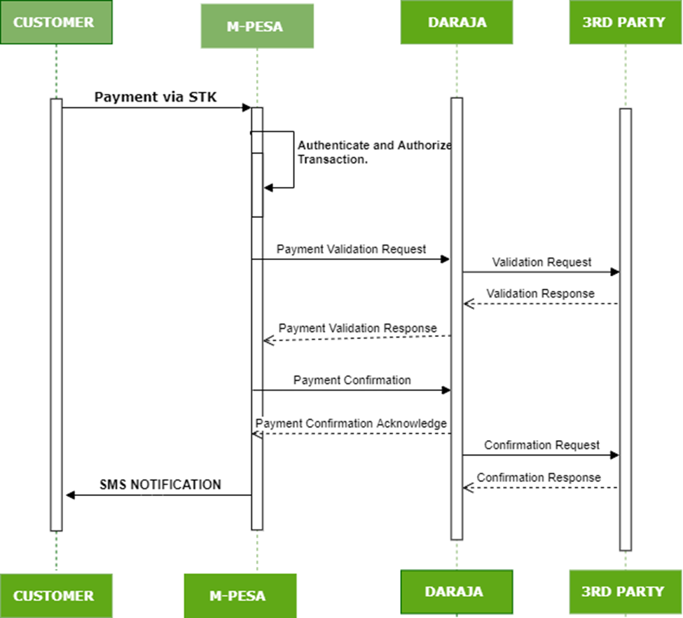

# CustomerToBusinessRegisterURL
**Source:** https://developer.safaricom.co.ke/apis/CustomerToBusinessRegisterURL

---

HomeAPIsDashboardMarketplaceFAQsMiniApps

Log Out

1. Discover APIs
2. /
3. Customer To Business Register URL

###### Customer To Business Register URL

By Safaricom

Register validation and confirmation URLs on M-Pesa

POST

https://sandbox.safaricom.co.ke/mpesa/c2b/v1/registerurl

Use API

Get Started in 3 easy steps

Open Simulator

API DocumentationError

Overview

Register URL API works hand in hand with Customer
to Business (C2B) APIs and allows receiving payment notifications to your
paybill. This API enables you to register the callback URLs via which you shall
receive notifications for payments to your pay bill/till number.

There are two URLs required for Register URL
API: **Validation URL** and **Confirmation URL**.

**Validation URL:** This is
the URL that is only used when a Merchant (Partner) requires to validate the
details of the payment before accepting. For example, a bank would want to verify
if an account number exists in their platform before accepting a payment
from the customer.

**Confirmation URL:**This is the URL that
receives payment notification once payment has been completed successfully on
M-PESA.

**NB: C2B Transaction Validation** is an optional
feature that needs to be activated on M-Pesa, the owner of the shortcode needs
to make this request for activation by emailing us at [apisupport@safaricom.co.ke](mailto:apisupport@safaricom.co.ke) or [M-pesabusiness@safaricom.co.ke](mailto:M-pesabusiness@safaricom.co.ke)  if they need their transactions validated
before execution.

The above chart, explains how URLs are registered to send requests and
receive responses.

Flowchart of the C2B process

**The process is explained below:**

1. Payment request to a pay bill by
   a customer from their phone.
2. M-PESA receives requests and
   validates them internally
3. M-Pesa then checks if **External
   Validation** has been activated for
   the paybill.
4. If External Validation is **enabled**:

1. M-PESA first sends a **Validation
   request** to the Validation URL registered in the system by the
   integrated partner with the payment details.
2. The integrated partner system
   validates the request and sends an appropriate response to M-PESA. This
   response must be received within a given period or M-Pesa marks the
   partner endpoint as unreachable. The response informs M-Pesa to either
   complete or cancel the payment:
3. M-Pesa receives the response and
   processes the transaction accordingly:
4. As explained in item **6** below, If you had registered a default
   action value to **complete** the transaction, M-PESA sends
   a **Confirmation request** to your Confirmation URL with the
   details of the completed transaction. The transaction is then complete.
   Thus you shall receive **two** API calls on your system.
5. If you had registered**cancelled** as the default
   action, M-Pesa simply cancels the transaction and no other request is
   sent. The transaction is then complete

5. If External Validation is **disabled**,
   M-Pesa automatically completes the transaction, and if the transaction is
   a success, M-Pesa sends a **Confirmation** request to the
   Confirmation URL registered in the system. This is the **only** API
   call you shall receive on your end.
6. If External Validation is **enabled**,
   but for some reason, M-Pesa could **not** reach your endpoint
   to validate the transaction within the stipulated time period (usually
   < 8 seconds from the moment the request leaves M-PESA), or no response
   was received by the time M-PESA terminates the request, it checks on the
   default action value saved during registration of the URLs. If the default
   action was set to **Completed**, M-PESA automatically completes
   the transaction and also tries to send a Confirmation request to your
   other endpoint. If the default action was set to **Cancelled**,
   M-Pesa simply cancels the transaction and no Confirmation callbacks are
   sent. The transaction is then complete.
7. If no URLs are registered in the
   system, M-PESA automatically completes the request.
8. M-PESA then sends an SMS
   notification to both the customer and the paybill owner with the results of
   the transaction as usual.
9. When
   external notifications fail to be sent, you can use Pull transaction API for
   reconciliation or check on the M-PESA Org portal <https://org.ke.m-pesa.com/login.action> and cross-check against received callbacks. The
   portal has all the payments ever made available, whether you received the
   callback or not.

URL Requirements

1. Use publicly available
   (Internet-accessible) IP addresses or domain names.
2. All
   Production URLs must be HTTPS, on Sandbox you're allowed to simulate using
   HTTP.
3. Avoid
   using keywords such as M-PESA, M-Pesa, M-Pesa, Safaricom, exe, exec, cmd, SQL, query, or any of their variants in either upper or lower cases in your URLs.
4. **Do
   not** use public
   URL testers e.g. [ngrok](https://ngrok.com/), [mockbin](http://mockbin.org/), or [requestbin](https://requestb.in/),**especially** on production, they are also usually
   blocked by the API. Use your own application URLs and do not make them public
   or share them with any of your peers.

**NB:**

On the sandbox, you are free to register your URLs multiple times or
even overwrite the existing ones. In the production environment, this is a
one-time API call that registers your validation and confirmation URLs to
have them changed you can delete them on the URL management tab under self-service and
re-register using register URL API, you can also email us at [apisupport@safaricom.co.ke](mailto:apisupport@safaricom.co.ke) for
assistance.

As you set up the default value, the words “Cancelled/Completed”
must be in sentence case and well-spelled.

Request Body

{

"ShortCode": "601426",

"ResponseType":"[Cancelled/Completed]",

"ConfirmationURL":"[confirmation URL]",

"ValidationURL":"[validation URL]"

}

Request Parameter Definition

|  |  |  |  |
| --- | --- | --- | --- |
| **Name** | **Description** | **Type** | **Sample Values** |
| Validation URL | This is the URL that receives the validation request from the API upon payment submission. The validation URL is only called if the external validation on the registered shortcode is enabled. (By default External Validation is disabled). | URL | <https://ip> or domain:port/path |
| ConfirmationURL | This is the URL that receives the confirmation request from API upon payment completion. | URL | <https://ip> or domain:port/path |
| ResponseType | This parameter specifies what is to happen if for any reason the validation URL is not reachable. Note that, this is the default action value that determines what M-PESA will do in the scenario that your endpoint is unreachable or is unable to respond on time. Only two values are allowed: Completed or Cancelled. Completed means M-PESA will automatically complete your transaction, whereas Cancelled means M-PESA will automatically cancel the transaction, in the event M-PESA is unable to reach your Validation URL. | String | - Canceled - Completed |
| Shortcode | Usually, a unique number is tagged to an M-PESA pay bill/till number of the organization. | Numeric | 123456 |

Response Body

{

"OriginatorCoversationID": "7619-37765134-1",

"ResponseCode": "0",

"ResponseDescription": "success"

}

Response Parameters Definition

|  |  |  |  |
| --- | --- | --- | --- |
| **Name** | **Description** | **Type** | **Sample Values** |
| OriginatorCoversationID | This is a global unique identifier for the transaction request returned by the API proxy upon successful request submission. | Alpha-numeric | An alpha-numeric string of fewer than 20 characters |
| ResponseCode | It indicates whether Mobile Money accepts the request or not. | Alpha-numeric | 0 |
| ResponseDescription | This is the status of the request. | String | Success |

**NB: Before any API request register URL is included, you will require authorization by generating an access token from the authorization API to allow you successfully make an API call.**

Once you’ve registered URLs as explained above, C2B API payment
transaction is initiated by the customer when they are paying. You can use the
simulator to have an overview of how the request looks. You don’t need to
develop anything on your side for this part.

Upon successful payment, we post the payment details to your
confirmation and validation URLs as explained in the resulting body below;

Result Body

**Validation Request**

The validation request is received only by partners who have the External Validation feature enabled on their PayBill or BuyGoods (Till Number) and require validating a payment before M-PESA completes the transaction. You will first receive a validation request to validate on your Validation URL.

The **Confirmation and Validation** result posted on your URLs after payment will have the structure below:

{

"TransactionType": "Pay Bill",

"TransID":"RKTQDM7W6S",

"TransTime":"20191122063845",

"TransAmount":"10"

"BusinessShortCode": "600638",

"BillRefNumber":"invoice008",

"InvoiceNumber":"",

"OrgAccountBalance":""

"ThirdPartyTransID": "",

"MSISDN":"25470\*\*\*\*149",

"FirstName":"John",

"MiddleName":""

"LastName":"Doe"

}

**Validation Response**

After receiving the validation request, you are required to process it and respond to the API call and inform M-PESA either to accept or reject the payment. To accept, you send the below JSON making sure the value of ResultCode is 0 (zero), but the value of ResultDesc is Accepted.

{

"ResultCode": "0",

"ResultDesc": "Accepted",

}

To reject a transaction, you send the same JSON above, but with the ResultCode set as C2B00011 (or any other value from the error table below), BUT NOT 0. The ResultDesc should be set as Rejected as shown below:

{

"ResultCode": "C2B00011",

"ResultDesc": "Rejected",

}

**Result Error Codes**

|  |  |
| --- | --- |
| **ResultCode** | **ResultDesc** |
| C2B00011 | Invalid MSISDN |
| C2B00012 | Invalid Account Number |
| C2B00013 | Invalid Amount |
| C2B00014 | Invalid KYC Details |
| C2B00015 | Invalid Shortcode |
| C2B00016 | Other Error |

Results Parameter Definition

|  |  |  |  |
| --- | --- | --- | --- |
| **Name** | **Description** | **Type** | **Sample Values** |
| TransactionType | The transaction type specified during the payment request. | String | Buy Goods or Pay Bill |
| TransID | This is the unique M-Pesa transaction ID for every payment request. This is sent to both the call-back messages and a confirmation SMS sent to the customer. | Alpha-numeric | LHG31AA5TX |
| TransTime | This is the Timestamp of the transaction, normally in the format of YEAR+MONTH+DATE+HOUR+MINUTE+SECOND (YYYYMMDDHHMMSS) Each part should be at least two digits apart from the year which takes four digits. | Time | YYYYMMDDHHmmss e.g. 20170813154301 |
| TransAmount | This is the amount transacted (normally a numeric value), money that the customer pays to the Shortcode. Only whole numbers are supported. | Numeric | 100 |
| BusinessShortCode | This is the organization's shortcode (Paybill or Buygoods - a 5 to 6-digit account number) used to identify an organization and receive the transaction. | String | Shortcode (5 to 6 digits) e.g. 654321 |
| BillRefNumber | This is the account number for which the customer is making the payment. This is only applicable to Customer PayBill Transactions | String | An alpha-numeric value of up to 20 characters. |
| OrgAccountBalance | The current utility account balance of the payment-receiving organization shortcode. For validation requests, this field is usually blank whereas, for the confirmation message, the value represents the new balance after the payment has been received. | Decimal | 30671 |
| ThirdPartyTransID | This is a transaction ID that the partner can use to identify the transaction. When a validation request is sent, the partner can respond with ThirdPartyTransID and this will be sent back with the Confirmation notification | String | 1234567890 |
| MSISDN | This is a masked mobile number of the customer making the payment. | Numeric | 25470\*\*\*\*149 |
| FirstName | The customer's first name is as per the M-Pesa register. This parameter can be empty. | String | John |
| MiddleName | The customer's middle name is as per the M-Pesa register. This parameter can be empty. | String | Doe |
| LastName | The customer's last name is as per the M-Pesa register. This parameter can be empty. | String |  |

**NB: Data minimization is a requirement from the data protection office not to share customers’ personal information without their consent.**

**Validation Response - Expected from your validation URL.**

|  |  |  |
| --- | --- | --- |
| **Name** | **Description** | **Type** |
| ResultCode | A code indicating whether to complete the transaction. 0(Zero) always means complete. Other values mean canceling the transaction, which also determines the customer notification SMS type. | Alpha-numeric |
| ResultDesc | Short validation result description | String |
| ThirdPartyTransID | An optional value that can be used to identify the payment during a confirmation callback. If a value is set, it would be passed back in a confirmation callback. | String |

**Confirmation acknowledgment - Expected from your Confirmation URL.**

|  |  |  |
| --- | --- | --- |
| **Name** | **Description** | **Type** |
| ResultCode | A code indicating the receipt status of the confirmation callback. Always 0(zero). | Number |
| ResultDesc | A short confirmation receipt description. Usually “Success”. | String |

Daraja 3.0

Daraja 3.0 is a web platform that offers access to Safaricom and M-PESA APIs that creates a bridge for payment integration to web and mobile apps. By connecting to our APIs, you open a world of possibilities to you and your clients. Together, we can transform lives.

Discover more

[Privacy Policy](/terms)

[Terms and Conditions](/terms)

Copyright@Safaricom PLC 2025

Ask Daraja about anything 😊

Logout of Daraja?

If you Logout, you will be required to Login again to access some features.

CancelLogout