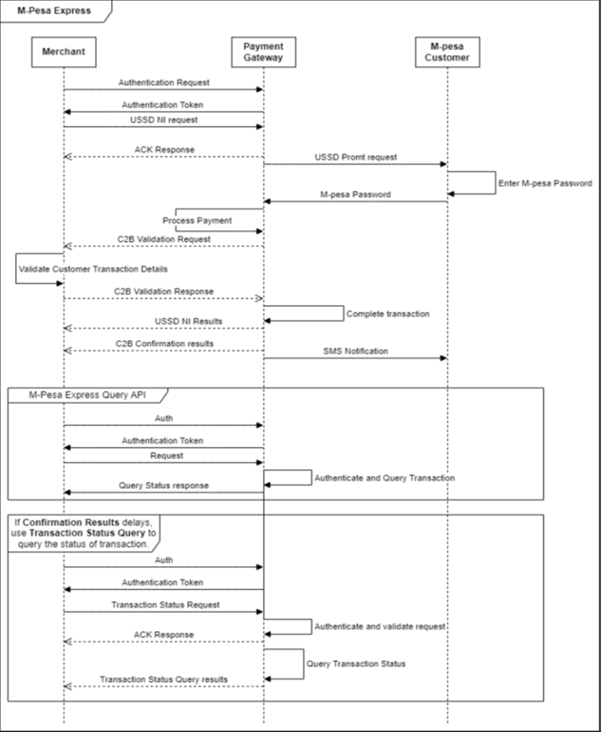
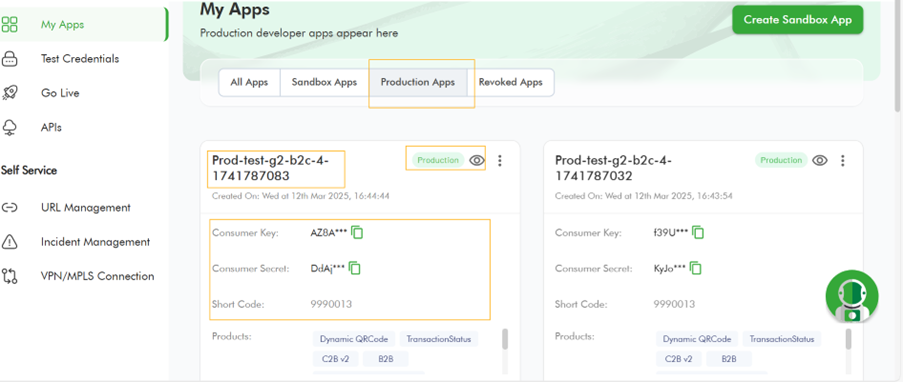
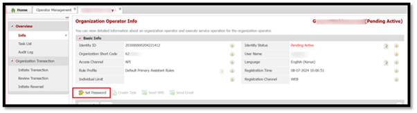

# MpesaExpressSimulate
**Source:** https://developer.safaricom.co.ke/apis/MpesaExpressSimulate

---

[](/)

HomeAPIsDashboardMarketplaceFAQsMiniApps

Log Out

1. Discover APIs
2. /
3. M-Pesa Express Simulate


###### M-Pesa Express Simulate

By Safaricom

Initiates online payment on behalf of a customer.

POST

https://sandbox.safaricom.co.ke/mpesa/stkpush/v1/processrequest

Use API

Get Started in 3 easy steps


Open Simulator

###### DOCUMENTATION

- Overview

- How It Works

- Getting Started

- Integration Steps

- Go live

- How To

- Support

## Overview

LIPA NA M-PESA ONLINE API also known as M-PESA express is a Merchant/Business initiated C2B (Customer to Business) transaction. Once the merchant integrates to the API, they can then initiate a payment authorization prompt to a customer whose phone number is registered and active on M-PESA.

## How It Works

1. The Merchant (Partner) captures and sets the required API parameters and sends the API request.
2. The API receives the request, validates it internally, and sends an acknowledgment response.
3. Through the API Proxy, a network-initiated push request is sent to the M-PESA-registered phone number of the customer making the payment.
4. The customer confirms the payment by entering their M-PESA PIN.
5. The response is sent back to M-PESA and processed as follows:
   * M-PESA validates the customer's PIN.
   * M-PESA debits the customer's mobile wallet.
   * M-PESA credits the Merchant (Partner) account.
6. Once the request is processed, the results are sent back to the API Management system, which then forwards them to the merchant via the callback URL specified in the request.
7. The customer receives an SMS confirmation message for the payment.

## Getting Started

### Prerequisites

1. Create a Daraja Account on [Safaricom Developer Portal](https://daraja.safaricom.co.ke/).
2. Create a sandbox app in the portal to get API credentials.
3. Retrieve Consumer Key & Consumer Secret from your sandbox app on [My Apps](https://daraja.safaricom.co.ke/dashboard/myapps).
4. Test data available on the simulator section
5. Passkey for encryption of the password parameter-on sandbox this is availed on test data on the simulator, in production this will be send on developer email after go-live
6. Live M-PESA pay bill/till number with Business Admin/Manager operators created - For Go live

### Good to Know

This API is asynchronous. You can consume this API over the internet, a virtual private network or Multiprotocol Switch.

#### Get Auth Token

Devs gather here! You will first generate an access token to authenticate you to make the API call. See below generate access token [API](https://daraja.safaricom.co.ke/dashboard/apis?api=Authorization) here. We’ve also automated this on the simulate request section.

## Environments

| Environment | Description | URL |
| --- | --- | --- |
| Sandbox | Testing environment. | <https://sandbox.safaricom.co.ke/mpesa/stkpush/v1/processrequest> |
| Production | Live environment for real transactions. | <https://api.safaricom.co.ke/mpesa/stkpush/v1/processrequest> |

## Integration Steps

### Sequence Diagram



### Use Cases

1. Reduction of wrong payments/reversals
   Wrong payments are significantly reduced because customers only need to enter their M-PESA PIN to validate transactions. There's no need to remember or manually input the pay bill/till number, amount, or account number—these details are pre-set by the merchant and included in the M-PESA push request.
2. Enhanced and shorter payment journey

**Request Body**

```json
{ 
    "BusinessShortCode": 174379, 
    "Password": "MTc0Mzc5YmZiMjc5ZjlhYTliZGJjZjE1OGU5N2RkNzFhNDY3Y2QyZTBjODkzMDU5YjEwZjc4ZTZiNzJhZGExZWQyYzkxOTIwMjEwNjI4MDkyNDA4", 
    "Timestamp": "20210628092408", 
    "TransactionType": "CustomerPayBillOnline", 
    "Amount": "1", 
    "PartyA": "254722000000", 
    "PartyB": "174379", 
    "PhoneNumber": "254722111111", 
    "CallBackURL": "https://mydomain.com/path",
    "AccountReference": "accountref", 
    "TransactionDesc": "txndesc" 
}
```

**Request Parameter Definition**

| Name | Description | Type | Sample Value |
| --- | --- | --- | --- |
| BusinessShortCode | The M-PESA Shortcode assigned to the Business. | Numeric | 654321 (5 to 6 digits) |
| Password | Base64 encoded string used for encrypting the request. Format: base64.encode(Shortcode+Passkey+Timestamp). | String | base64.encode(Shortcode+Passkey+Timestamp) |
| Timestamp | Timestamp of the transaction in the format YYYYMMDDHHmmss. | Timestamp | 20210628092408 |
| TransactionType | Identifies the transaction type. Use "CustomerPayBillOnline" for PayBill Numbers and "CustomerBuyGoodsOnline" for Till Numbers. | String | CustomerPayBillOnlineCustomerBuyGoodsOnline |
| Amount | The transaction amount. | Numeric | 10 |
| PartyA | The phone number sending money. Must be a valid Safaricom M-PESA number in the format 2547XXXXXXXX. | Numeric | 254722000000 |
| PartyB | The organization receiving the funds (credit party). | Numeric | 174379 |
| PhoneNumber | The mobile number to receive the USSD prompt. Can be the same as PartyA. Format: 2547XXXXXXXX. | Numeric | 254722111111 |
| CallBackURL | The URL where the payment gateway will send the result. | URL | <https://mydomain.com/path> |
| AccountReference | Alpha-numeric identifier for the transaction, defined by your system. Displayed to the customer in the USSD prompt. Max 12 characters. | Alpha-Numeric | accountref |
| TransactionDesc | Additional information/comment for the request. Max 13 characters. | String | txndesc |

> **Note:** All fields apart from TransactionDesc are all mandatory.

**Response Body**

```json
{ 
    "MerchantRequestID": "2654-4b64-97ff-b827b542881d3130", 
    "CheckoutRequestID": "ws_CO_1007202409152617172396192", 
    "ResponseCode": "0", 
    "ResponseDescription": "Success. Request accepted for processing", 
    "CustomerMessage": "Success. Request accepted for processing" 
}
```

**Response Parameter Definition**

| Name | Description | Type | Sample Value |
| --- | --- | --- | --- |
| MerchantRequestID | Global unique identifier for the transaction request returned by the API proxy upon successful request submission. | String | 2654-4b64-97ff-b827b542881d3130 |
| CheckoutRequestID | Global unique identifier for the transaction request returned by M-PESA upon successful request submission. | String | ws\_CO\_1007202409152617171293992 |
| ResponseCode | Numeric status code indicating the status of the transaction submission. `0` means successful submission; any other code indicates an error. | Numeric | 0 |
| ResponseDescription | Acknowledgment message from the API that gives the status of the request submission, usually mapping to a specific ResponseCode value. | String | Accept the service request successfully |
| CustomerMessage | Message intended for the customer, usually confirming the status of the request. | String | Success. Request accepted for processing |

### Callback Payload

#### Sample Unsuccessful Callback Payload

```json
{
    "Body": {
        "stkCallback": {
            "MerchantRequestID": "f1e2-4b95-a71d-b30d3cdbb7a7942864",
            "CheckoutRequestID": "ws_CO_21072024125243250722943992",
            "ResultCode": 1032,
            "ResultDesc": "Request cancelled by user"
        }
    }
}
```

#### Sample Successful Callback Payload

```json
{
    "Body": {
        "stkCallback": {
            "MerchantRequestID": "29115-34620561-1",
            "CheckoutRequestID": "ws_CO_191220191020363925",
            "ResultCode": 0,
            "ResultDesc": "The service request is processed successfully.",
            "CallbackMetadata": {
                "Item": [
                    {
                        "Name": "Amount",
                        "Value": 1.00
                    },
                    {
                        "Name": "MpesaReceiptNumber",
                        "Value": "NLJ7RT61SV"
                    },
                    {
                        "Name": "TransactionDate",
                        "Value": 20191219102115
                    },
                    {
                        "Name": "PhoneNumber",
                        "Value": 254708374149
                    }
                ]
            }
        }
    }
}
```

### Callback Parameter Definition

| Parameter | Description | Type | Optional | Sample Value |
| --- | --- | --- | --- | --- |
| Body | Root key for the entire callback message. | JSON Object | No | { "Body": { ... } } |
| stkCallback | First child of the Body, contains the callback details. | JSON Object | No |  |
| MerchantRequestID | Global unique identifier for the submitted payment request. Same as in the initial request response. | String | No | 7071-4170-a0e4-8345632bad441652435` |
| CheckoutRequestID | Global unique identifier for the processed checkout transaction request. Same as in the initial request response. | String | No | ws\_CO\_21072024125130652700961992 |
| ResultCode | Numeric status code indicating the transaction processing status. 0 means success; any other code means error or failure. | Numeric | No | 0, 1032 |
| ResultDesc | Message describing the status of the request processing. Maps to the ResultCode value. | String | No | The service request is processed successfully.Request cancelled by user |

**Additional parameters for successful requests:**

| Parameter Name | Description | Type | Optional | Sample Value |
| --- | --- | --- | --- | --- |
| CallbackMetadata | JSON object holding more transaction details. Returned only for successful transactions. | JSON Object | Yes |  |
| Item | Array within CallbackMetadata holding additional transaction details as JSON objects. Only for successful transactions. | JSON Array | Yes |  |
| Amount | Amount transacted. | Decimal | Yes | 10500.00 |
| MpesaReceiptNumber | Unique M-PESA transaction ID for the payment request. Also sent to customer via SMS. | String | Yes | SG722NMVXQ |
| Balance | Balance of the account for the shortcode used as PartyB. | Decimal | Yes | 32009.9 |
| TransactionDate | Timestamp for when the transaction completed, format YYYYMMDDHHmmss. | Timestamp | Yes | 20170827163400 |
| PhoneNumber | Number of the customer who made the payment. | PhoneNumber | Yes | 254722000000 |

**Results Parameter Definition**

| Name | Description | Type | Sample Values |
| --- | --- | --- | --- |
| ConversationID | The unique identifier generated by M-PESA for a request. | String | AG\_20180223\_0000493344ae97d86f75 |
| OriginatorConversationID | The unique identifier of the request message. This is auto-generated by M-PESA for third-party/Organizations. Its value comes from the response message. It can be used to check the status of the transaction. | String | 3213-416199-2 |
| ReferenceData | It is used to carry some reference data that M-PESA need not analyse but need to record into the transaction log. | ReferenceData | n/a |
| ReferenceItem | It is used to carry some reference data that MM needs not analyse but needs to record in the transaction log. | ParameterType | n/a |
| ResultCode | It indicates whether M-PESA processes the request successfully or not. The max length is 10. | String | 0 |
| ResultDesc | Its value is a description of the parameter Result Code. The max length is 1024. | String | The service request is processed successfully. |
| ResultParameters | It is used to carry specific parameters for reversals API. | n/a | n/a |
| Key | It indicates a parameter name. | String | DebitPartyName |
| Value | It indicates a parameter value. | String | 600310 - Safaricom333 |
| ResultType | 0: completed 1: waiting for further messages. | Integer | 0 |
| TransactionID | It’s only for transactions. When the request is a transaction request, M-PESA will generate a unique identifier for the transaction. | String | MBN0000000 |

## Error Codes

### Sample Error Response

```json
{
    "requestId": "1c5b-4ba8-815c-ac45c57a3db01495926",
    "errorCode": "400.002.02",
    "errorMessage": "Bad Request - Invalid BusinessShortCode"
}
```

### Common Error Codes

| errorCode | errorMessage | Mitigation | HTTP Code |
| --- | --- | --- | --- |
| 400.002.02 | Bad Request – Invalid XXXX. | Ensure the request payload is set as per API documentation. | 400 |
| 404.001.03 | Invalid Access Token | Regenerate a new access token and use it before one hour expiry period. Also ensure you’re using the correct consumer key and consumer secret attached to the Daraja application. | 404 |
| 404.001.01 | Resource not found | Make sure you are calling the correct API endpoint. | 404 |
| 405.001 | Method Not Allowed (e.g. GET Method Not Allowed) | Ensure you’re passing the request as POST. Any other method will be rejected. | 405 |
| 500.001.1001 | Merchant does not exist | Ensure you’re using the short code used on Go Live as BusinessShortCode parameter value in the request. | 500 |
| 500.001.1001 | Wrong credentials | This error can be caused by:- The Password parameter provided in the request is either invalid or missing.- The Password given (after proper encoding: base64.encode(Shortcode+Passkey+Timestamp)) does not match the BusinessShortCode.- Either the BusinessShortCode or Timestamp used in encoding the Password does not match the one used in the body of the request. | 500 |
| 500.001.1001 | Unable to lock subscriber, a transaction is already in process for the current subscriber | There is an ongoing session that conflicts with the PUSH request. Wait at least 1 minute between requests to allow previous sessions to complete. |  |
| 500.003.02 | System is busy. Please try again in few minutes. | Retry the request after a short wait. |  |
| 500.003.1001 | Internal Server Error | Make sure everything on your side is correctly set up as per the documentation and your server is running as expected. | 500 |
| 500.003.02 | Error Occurred: Spike Arrest Violation | You are sending multiple requests that violate the API transaction per second limit. Ensure your application/system is not sending excessive requests. | 500 |
| 500.003.03 | Quota Violation | You are sending multiple requests that violate the API request limit. Ensure your application/system is not sending excessive requests. | 500 |

## Response codes

| Response Code | Response Description |
| --- | --- |
| 0 | Success |

## Result codes

| Code | Description | Explanation |
| --- | --- | --- |
| 0 | The service request is processed successfully. | The transaction has been processed successfully on M-PESA. |
| 1 | The balance is insufficient for the transaction. | The customer does not have enough money in their M-PESA account to complete the transaction. |
| 2 | Declined due to limit rule. | The amount provided is less than the allowed C2B transaction minimum (currently Ksh 1). |
| 3 | Declined due to limit rule: greater than the maximum transaction amount. | The amount provided exceeds the allowed C2B transaction maximum. |
| 4 | Declined due to limit rule: would exceed daily transfer limit. | The transaction would exceed the customer's daily transfer limit (currently Ksh 500,000). |
| 8 | Declined due to limit rule: would exceed the maximum balance. | Processing the transaction would exceed the Pay Bill or Till Number account balance limit. |
| 17 | Rule limited. | Transactions were initiated in succession (within 2 minutes) for the same amount to the same customer. Wait at least 2 minutes between such requests. |
| 1019 | Transaction has expired. | The transaction was not processed within the allowable time. |
| 1025 | An error occurred while sending a push request. | The USSD prompt message is too long (over 182 characters). Ensure the account reference value is not too long. |
| 1032 | Request cancelled by user. | The prompt was canceled by the user. |
| 1037 | DS timeout user cannot be reached. | The customer's phone could not be reached with the NIPUSH prompt (phone offline, busy, or ongoing session). |
| 2001 | The initiator information is invalid. | The customer entered an incorrect M-PESA PIN. Advise the customer to use the correct PIN. |
| 2028 | The request is not permitted according to product assignment. | Either the TransactionType or PartyB is incorrect. **For BuyGoods/Tills:**- BusinessShortCode: short code used on Go Live- PartyB: Till Number- TransactionType: CustomerBuyGoodsOnline**For Pay Bills:**- BusinessShortCode: short code used on Go Live- PartyB: Pay Bill- TransactionType: CustomerPayBillOnline |
| 8006 | The security credential is locked. | The customer should contact Customer Care (call 100 or 200) for assistance. |
| SFC\_IC0003 | The operator does not exist. | Either the TransactionType or PartyB is incorrect. **For BuyGoods/Tills:**- BusinessShortCode: short code used on Go Live- PartyB: Till Number- TransactionType: CustomerBuyGoodsOnline**For Pay Bills:**- BusinessShortCode: short code used on Go Live- PartyB: Pay Bill- TransactionType: CustomerPayBillOnline |

## Next steps

### TESTING

***Testing time Devs***

### Option 1: Daraja Simulator

Create a new test app under apps on the main nerve bar, select transaction status product. Once app is successfully created the simulator is automated to pick app credentials (Consumer key and Consumer Secret) and predefined test data, you can hit the simulate button.


### Option 2: Postman

Use the credentials to generate access token using the below endpoint.

* Sandbox: `https://sandbox.safaricom.co.ke/mpesa/stkpush/v1/processrequest`
* Production: `https://api.safaricom.co.ke/mpesa/stkpush/v1/processrequest`
  Initiate Transaction status using the above transaction status request body. Download the availed postman collection. Ensure to replace the parameters with actual credentials.

### GO LIVE

**Time to launch, here Dev you need help from the business teams no more Rambo stunts behind the keyboard. Some collaboration will do; a handshake to the business team in the morning it is. Wait! You can act Rambo if you are both the Business and Dev**

We’ve already tested, and finished development—now attach the integration to a live pay bill/till number. Navigate to the **GO LIVE** tab and fill in the required fields with live data.

**Requirements:**

* **Organization short code:** Pay bill number, Store Number for a Till, HO number, or B2C account short code (see FAQs for more insights).
* **Organization name:** The name of your organization. Shorten the organization name on Go Live and remove any symbols or special characters.
* **Mpesa Username:** Username of the operator with Business Administrator or Business Manager role assigned on the M-PESA Org portal. Username is case sensitive on Go Live.

For the creation of an administrator on the M-PESA Org portal, contact the [M-PESABusiness@Safaricom.co.ke](mailto:M-PESABusiness@Safaricom.co.ke) team.

**Note:** OTP for Go Live is sent to the phone number specified under the user profile on the M-PESA portal. Ensure the linked phone number is a Safaricom line to receive the OTP.

In case of challenges, use our Daraja assistant, raise an incident on self-services, or email [APISupport@safaricom.co.ke](mailto:APISupport@safaricom.co.ke) for further guidance.

Kindly visit our How-To section for more information on M-PESA Org portal access and user creation.


Upon successful go live, production endpoints will be sent to developer email and the test sandbox app will be moved to production with production consumer key and secrets. Below is how to see the production app.


**We’ve successfully deployed dev congratulations we are now live!**

## How To

**Access to the M-PESA Organization Portal and create Users**

The M-PESA organization portal is a platform designed for businesses and organizations to manage their financial transactions through the M-PESA services.

The portal offers various features for businesses, including:

1. Transaction Management: Monitor and manage transactions, generate reports, and reconcile accounts.
2. Account Management: Manage multiple user accounts with different access levels within the organization.
3. Bulk Payments: Facilitate bulk payments to employees, suppliers, and other beneficiaries efficiently.

**Access to the M-PESA Organization Portal**


To access the Organization portal (<https://org.ke.m-pesa.com/orglogin.action>), you need to have a Business Administrator role created under your business short code (Pay Bill/ Till).

The first step before getting access, is to ensure the settlement option set to your short code is Bank via a Head Office application.

To make an application for a Head Office for your short code/Store Number kindly contact [M-PESABusiness@Safaricom.co.ke](mailto:M-PESABusiness@Safaricom.co.ke) where they will provide you with the forms to be filled.

After Head Office is created the [M-PESABusiness@Safaricom.co.ke](mailto:M-PESABusiness@Safaricom.co.ke) will also guide on the creation of the Business Administrator (username).

**How to login to M-PESA Organization Portal For the first time:**

1. Launch the link from any of the browsers: <https://org.ke.m-pesa.com>.
2. Enter the Short code which is Bulk payment number.
3. Enter the Business Administrator username received

To make an application for a Head Office for your short code/Store Number kindly contact [M-PESABusiness@Safaricom.co.ke](mailto:M-PESABusiness@Safaricom.co.ke) where they will provide you with the forms to be filled.
After Head Office is created, the [M-PESABusiness@Safaricom.co.ke](mailto:M-PESABusiness@Safaricom.co.ke) will also guide on the creation of the Business Administrator (username).

## How to login to M-PESA Organization Portal For the first time:

1. Launch the link from any of the browsers: <https://org.ke.m-pesa.com>.
2. Enter the Short code which is Bulk payment number.
3. Enter the Business Administrator username received on email.
4. Enter the first-time password received on the same email – the Password is case-sensitive (full stop is not part of the password).
5. Enter the Verification Code displayed then click login, on the Next Page.
6. Enter OTP to proceed to the change password page.
7. Enter the first-time password on email, then proceed to set a new password.
8. Confirm password, security question, and security answer one and two which are mandatory.
9. The Password must meet the password rules as instructed.
10. Submit to successfully activate the Business Administrator account.
11. After activation, you will only be entering your username, shortcode, and password verification code and entering the OTP received via SMS to log in.

## Account Types in C2B Organization

1. **MMF/WORKING/M-PESA ACCOUNT FOR ORGANIZATION**

   * When an organization wants to make a business withdrawal, the funds are transferred to this account before the withdrawal request is made.
2. **UTILITY ACCOUNT**

   * Payments from customers are credited into the utility account.
3. **CHARGES PAID ACCOUNT**

   * For payments received from customers, depending on the tariff, a charge is levied on the Organization or is split between the organization and the customer. The charges paid account is debited and always accrues a negative balance which has to be settled before an organization can make a withdrawal request.
4. **ORGANIZATION SETTLEMENT ACCOUNT**

   * This account does the calculations for the organization operator when s/he initiates a revenue settlement. This account settles the charges paid account and then moves the balance from the Utility Account to the MMF account automatically. You will notice that the transaction type “Move funds from Utility to MMF” is no longer available as the revenue settlement process takes care of this.

## Various Roles under the portal

### Business Administrator role

The Business Administrator role is crucial for managing and overseeing user activities within the portal.

**Responsibilities of a Business Administrator:**

1. Create other system users and give them roles depending on what he/she wants them to do within the portal. The roles include:
   * A Business Web Operator who can initiate transactions, access statements, and check balance.
   * A business manager.
   * A Business Auditor – View Only/ Read Only Rights.
2. Not able to view transactions.
3. User created by Safaricom ([M-PESABusiness@Safaricom.co.ke](mailto:M-PESABusiness@Safaricom.co.ke)).

### Business Manager

The Business manager approves transactions, checks balances, and access statements.

**Responsibilities of a Business Manager:**

1. The user can View statements.
2. The user can initiate transactions.
3. The user can Approve/reject other transactions.
4. The user can withdraw funds from M-PESA.

**Proceed as below to create a business manager:**

1. Log in the Organization portal as the Business administrator.
2. Select operators.


3. Then click the add option.
4. It will take you to a new page where you will enter the username of the operator.
5. Select access channel as Web.


6. Then select web profile default rule profile.
7. Then assign role...Business Manager and Set Restricted ORG API PASSWORD.


8. Enter the KYC information of the operator then submit.

### API user creation

**Proceed as below to create an API Operator:**

1. Log in as the Business administrator.
2. Select operators.


3. Then click the add option.
4. It will take you to a new page where you will enter the username of the API initiator.
5. Select access channel as API.
6. Then select web profile default rule profile.
7. Then assign role...look for the ORG B2C API initiator, Balance Query ORG API, Transaction Status query ORG API roles.


8. Enter the KYC information of the operator then submit.

**Here is how to set the password for the API user:**

1. Login as User with the Set Restrict Password Role i.e. The Business Manager.


2. Click on My Functions, Then Operator Management.
3. Enter the API username to search after it populates the API user, At the end click on operations.
4. Then click on set password avoid such (@ or.) in the setting of this password.



### Various API roles:

| API | API Role Assignment |
| --- | --- |
| B2C | ORG B2C API Initiator. |
| Business Pay Bill | Business Paybill Org API initiator. |
| Business Buy Goods | Business Buy Goods Org API initiator. |
| Transaction Status | Transaction Status query ORG API. |
| Reversals | Org Reversals Initiator. |
| Tax Remittance | Tax Remittance to KRA API. |
| Set Password role | Set Restricted ORG API PASSWORD. |

## How to apply for a live pay bill number/till number or B2C Account

Apply here: [M-PESABusiness@Safaricom.co.ke](mailto:M-PESABusiness@Safaricom.co.ke)

## Support

### Chatbot

Developers can get instant responses using the Daraja Chatbot for both development and production support.

### Production Issues & Incident Management

For production support and incident management, use:

* **Incident Management Page:** Visit the [Incident Management](https://daraja.safaricom.co.ke/dashboard/incidentmanagement) page.
* **Email:** Reach out to API support at [apisupport@safaricom.co.ke](mailto:apisupport@safaricom.co.ke).

### FAQs

1. **Why am I not receiving callbacks on my CallbackURL?**

   * Ensure your CallbackURL is publicly accessible over the internet.
   * Use a valid IP address or domain name.
   * Confirm your endpoint is not blocked by firewalls or network restrictions.
2. **What should I do if I encounter an invalid access token error?**

   * Check that your access token has not expired (tokens expire hourly).
   * Make sure you are using the correct consumer key and consumer secret to generate the token.
3. **Can I use my actual pay bill on the Daraja portal simulator?**

   * No. The Daraja simulator only supports sandbox test short codes.
   * To test with your actual short code, use your application or a REST client like Postman.
4. **Do you have a test environment for M-PESA Express API?**

   * Yes. The sandbox environment and test credentials (including test short codes) are available on the Daraja developer portal.
   * You can test using the Daraja simulator, your application, or any REST client.
5. **What are the transaction limits for M-PESA Express?**

   * A registered customer can receive up to Ksh 250,000 per transaction.
   * The maximum customer account balance is Ksh 500,000.
   * The daily transaction value limit is Ksh 500,000.
   * The minimum transaction amount is Ksh 1.
6. **What should I do to resolve the "Invalid API call as no apiproduct match found" error?**

   * For production, ensure the Lipa na M-PESA production product is enabled on your Daraja application.
   * For Sandbox, ensure the M-PESA Express Sandbox product is enabled.
   * Verify you are calling the correct API endpoint.
7. **Can I reverse an M-PESA Express transaction using the Reversal API?**

   * Yes.
8. **Where do I view the transaction history for M-PESA Express transactions?**

   * Use the M-PESA Org portal: <https://org.ke.m-pesa.com/> to view all transactions for your business account.
9. **Why am I getting "Bad Request - Invalid BusinessShortCode" error?**

   * Possible causes:
     1. Wrong request Content-Type. Ensure to specify Content-Type: application/json in your request headers.
     2. Incorrect parameter name.
     3. Invalid or missing BusinessShortCode value.
10. **Can I use a Till Number for STK Push API?**

    * Yes, you can integrate a Till Number with the M-PESA Express/STKpush API.
    * Ensure the parameters are set as below:
      + BusinessShortCode: Short code used on Go Live (HO/store number)
      + PartyB: Till Number
      + TransactionType: CustomerBuyGoodsOnline

Daraja 3.0

Daraja 3.0 is a web platform that offers access to Safaricom and M-PESA APIs that creates a bridge for payment integration to web and mobile apps. By connecting to our APIs, you open a world of possibilities to you and your clients. Together, we can transform lives.

Discover more

[Privacy Policy](/terms)

[Terms and Conditions](/terms)

Copyright@Safaricom PLC 2025

Ask Daraja about anything 😊


Logout of Daraja?

If you Logout, you will be required to Login again to access some features.

CancelLogout