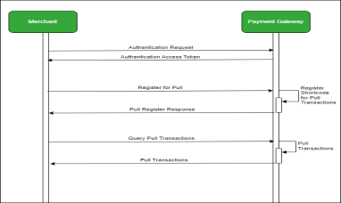

# PullTransaction
**Source:** https://developer.safaricom.co.ke/apis/PullTransaction

---

[](/)

HomeAPIsDashboardMarketplaceFAQsMiniApps

Log Out

1. Discover APIs
2. /
3. Pull Transactions


###### Pull Transactions

By Safaricom

This is a reconciliation API that allows a partner to query all transactions performed under their shortcode for C2B.

POST

https://sandbox.safaricom.co.ke/pulltransactions/v1/register

Use API

Get Started in 3 easy steps


Open Simulator

###### DOCUMENTATION

- Overview

- How It Works

- Getting Started

- Integration Steps

- Go live

- How To

- Support

## Overview

The Pull Transactions API is a reconciliation tool that lets partners query all C2B transactions performed under their Pay bill/Till number within the last 48 hours. It stores transaction data and helps recover any transactions that failed to reach the registered callback URLs during a specific period, providing a complete list of both successful and missed notifications.

## How It Works

1. The merchant is authenticated to register their Pay bill or Till number for pulling transactions via API
2. Due to system downtime, the merchant misses some callback notifications from M-PESA.
3. The merchant sends a GET request to retrieve all transactions for a specified period.
4. The merchant reconciles the transactions using the retrieved data.

## Getting Started

### Prerequisites

* Create a Daraja Account on Safaricom Developer Portal.
* Create a sandbox app to get API credentials.
* Retrieve Consumer Key & Consumer Secret.
* Use test data from the simulator section.
* Live M-PESA pay bill/till number with Business Admin/Manager operators created with an existing C2B API intergration - For Go live

### Good to Know

* The API is asynchronous.
* Method is POST for Register Pull and GET for Pull transaction
* Can be consumed over the internet, VPN, or Multiprotocol Switch.

#### Get Auth Token

Generate an access token to authenticate API calls. See [Authorization API](https://daraja.safaricom.co.ke/dashboard/apis?api=Authorization).

## Environments

| Environment | Description | Register Pull | Query Pull Transaction |
| --- | --- | --- | --- |
| Sandbox | Testing | <https://sandbox.safaricom.co.ke/pulltransactions/v1/register> | <https://sandbox.safaricom.co.ke/pulltransactions/v1/query> |
| Production | Live | <https://api.safaricom.co.ke/pulltransactions/v1/register> | <https://api.safaricom.co.ke/pulltransactions/v1/query> |

## Integration Steps

### Sequence Diagram



### Use Cases

1. Payment reconciliation
2. Reduce reversals

### Request Body

## 1. Register Pull

To use the Pull API, a user must register their short code by calling the Register Pull endpoint. The short code must belong to a user who is live and operating in the production environment.  
Note: The Pull API registration is a one-time process required to enable transaction pulling.

**Headers**

| Key | Value |
| --- | --- |
| Content-Type | application/json |
| Accept-Encoding | application/json |
| Authorization | Bearer `access_token` |

**Sample Request Body**

```json
{ 
  "ShortCode":"600000", 
  "RequestType":"Pull", 
  "NominatedNumber":"0722000000", 
  "CallBackURL":"https://domain/path" 
}
```

### Request Parameter Definition

| Name | Description | Parameter Type | Sample Values |
| --- | --- | --- | --- |
| ShortCode | Organization ShortCode that was used during Go- Live process. | Numeric | 17831 |
| RequestType | Defines the type of operation, default value is Pull | String | Pull |
| NominatedNumber | This is Safaricom MSISDN associated with the organization account using Pull | String | 254722000000 |
| CallBackURL | A CallBack URL is a valid secure URL. | String | <https://mydomain.com/confirmation> |

```json
{
  "ResponseRefID": "feb5e3f2-fbc-4745-844c-ee37b546f627",
  "ResponseStatus": "1000",
  "ShortCode": "600000",
  "ResponseDescription": "Shortcode Registered Successfully"
}
```

## 2. Query Pull Transaction

**Headers**

| Key | Value |
| --- | --- |
| Content-Type | application/json |
| Authorization | Bearer |

**Sample Request Body**

```json
{ 
  "ShortCode":"600000", 
  "StartDate":"2020-08-04 8:36:00", 
  "EndDate":"2020-08-16 10:10:000", 
  "OffSetValue":"0" 
}
```

### Request Parameter Definition

| Name | Description | Parameter Type | Sample Values |
| --- | --- | --- | --- |
| ShortCode | This is your paybill number/till number, which you expect to receive payments notifications about. | Numeric | 17843 |
| StartDate | The start period of the missing transactions in the format of YYYY-07-31 20:35:21 / 2019-07-31 19:00 | String | 2019-07-31 20:35:21 / 2019-07-31 19:00 |
| EndDate | The end of the period for the missing transactions in the format of 2019-07-31 20:35:21 / 2019-07-31 22:35 | String | 2019-07-31 20:35:21 / 2019-07-31 22:35 |
| OffSetValue | Starts from 0. The service uses offset as opposed to page numbers. The OFF- SET value allows you to specify which row to start from retrieving data. Suppose you wanted to show results 101-200. With the OFFSET keyword you type the (page number/index/offset value) 100. | Numeric | type the (page number/index/offset value) 100. |

### Response Body

**1. Register Pull**

```json
{
  "ResponseRefID": "feb5e3f2-fbc-4745-844c-ee37b546f627",
  "ResponseStatus": "1000",
  "ShortCode": "600000",
  "ResponseDescription": "Shortcode Registered Successfully"
}
```

**2. Query Pull Transaction**

```json
{ 
  "ShortCode":"600000", 
  "StartDate":"2020-08-04 8:36:00", 
  "EndDate":"2020-08-16 10:10:000", 
  "OffSetValue":"0" 
}
```

### Response Parameter Definition

**1. Register Pull**

| Name | Description | Parameter Type | Sample Values |
| --- | --- | --- | --- |
| ResponseRefID | This is a global unique Identifier of the request | String | 92713e02-970c-47ac-93f8-409058f2c58d |
| Response Status | This is the status code of the request. | Numeric | 1000 |
| ShortCode | Organization ShortCode | String | 600638 |
| Response Description | This is the status of the request. | String | Shortcode Registered Successfully |

**2. Query Pull Transaction**

| Name | Description | Parameter Type | Sample Value |
| --- | --- | --- | --- |
| ResponseRefID | This is a global unique Identifier of the request | String | 92713e02-970c-47ac-93f8-409058f2c58d |
| ResponseCode | This is a numeric status code that indicates the status of the transaction processing. 0 means successful processing and any other code means an error occurred or the transaction failed | String | 1000 |
| ResponseMessage | The response description is a message from the API that gives the status of the request processing. It usually maps to a specific ResponseCode value. It can be a Success processing message or an error description message | String | Success |
| transactionId | This is the unique M-PESA transaction ID. | String | LHG31AA5TX |
| trxDate | This is a timestamp that represents the date and time that the transaction was completed | String | 2020-08-05T10:13:00Z |
| msisdn | This is the number of the customer who made the payment. | Numeric | 72200000 |
| transactiontype | The Type of the transaction made by the customer | String | c2b-pay-bill-debit |
| billreference | This is the account number for which the customer is making the payment. This is only applicable to Customer PayBill Transactions | String | An alpha-numeric value of up to 20 characters. |
| amount | This is the Amount that was transacted | Decimal | 233.8 |
| organizationname | The name of your Organization used on go-live | String | Daraja Pull API Test |

## Response Codes

**1. Register Pull**

| Code | Description |
| --- | --- |
| 1000 | Short code Registered Successfully |
| 1001 | ShortCode already Registered |

**2. Query Pull Transaction**

| Code | Description |
| --- | --- |
| 1000 | Success, transactions fetched successfully |
| 1001 | • Null, No transactions available for the selected time period. • The response body is "Transaction": "[[]]" |

## Error Codes

| Code | Description |
| --- | --- |
| 400.001 | Invalid ShortCode |
| 401.001 | Invalid Access Token |
| 500 | Failed to retrieve transactions. The short code does not have any available transactions. |

## Next Steps

### Testing

#### Option 1: Daraja Simulator

* Create a test app, select C2B product.
* Simulator uses app credentials and predefined test data.
* Register URLs before each simulation.
* Select "CustomerPayBillOnline" for Paybill or "CustomerBuyGoodsOnline" for Till.


#### Option 2: Postman

* Generate access token using endpoints above.
* Download Postman collection.
* Use "Register C2B Confirmation and Validation URLs" request.
* Simulate payments using appropriate requests.
* Replace parameters with actual credentials.

> **Note:** "Simulate C2B Request" is only available in Sandbox.

### Go Live

* Attach integration to a live Paybill/Till number.
* Fill in live data: short code, organization name, M-PESA admin/manager username.
* Visit "GO LIVE" tab for more info.


Upon successful go live, production endpoints are sent to developer email.

## How To

### Access M-PESA Organization Portal and Create Users

The portal allows businesses to manage transactions, accounts, bulk payments, and user roles.


* Access: <https://org.ke.m-pesa.com/orglogin.action>
* Business Administrator role required.

#### First-Time Login Steps

1. Launch <https://org.ke.m-pesa.com>.
2. Enter Short code (Bulk payment number).
3. Enter Business Administrator username.
4. Enter first-time password (case-sensitive).
5. Enter Verification Code and login.
6. Enter OTP, set new password, security questions, and activate account.

## Account Types in C2B Organization

1. **MMF/Working/M-PESA Account**: For business withdrawals.
2. **Utility Account**: Receives customer payments.
3. **Charges Paid Account**: Debited for transaction charges.
4. **Organization Settlement Account**: Settles charges and moves balance.

## Portal Roles

### Business Administrator

* Creates system users and assigns roles.
* Cannot view transactions.
* Created by Safaricom.

### Business Manager

* Approves transactions, checks balances, views statements, withdraws funds.

**Steps to Create Business Manager:**

1. Log in as Business Administrator.
2. Select operators.
3. Click "Add".
4. Enter username, select access channel as Web.
5. Assign role, set password, submit KYC info.


### API User Creation

**Steps:**

1. Log in as Business Administrator.
2. Select operators.
3. Click "Add".
4. Enter API initiator username, select access channel as API.
5. Assign API roles, submit KYC info.


**Set API User Password:**

1. Log in as Business Manager.
2. Go to Operator Management.
3. Search API user, click operations, set password.


### API Roles

| API | Role Assignment |
| --- | --- |
| B2C | ORG B2C API Initiator |
| Business Pay Bill | Business Paybill Org API initiator |
| Business Buy Goods | Business Buy Goods Org API initiator |
| Transaction Status | Transaction Status query ORG API |
| Reversals | Org Reversals Initiator |
| Tax Remittance | Tax Remittance to KRA API |
| Set Password role | Set Restricted ORG API PASSWORD |

## Apply for Live Paybill/Till/B2C Account

Email: [M-PESABusiness@Safaricom.co.ke](mailto:M-PESABusiness@Safaricom.co.ke)

## Support

### Chatbot

Use Daraja Chatbot for instant development and production support.

### Production Issues & Incident Management

* [Incident Management Page](https://daraja.safaricom.co.ke/dashboard/incidentmanagement)
* Email: [apisupport@safaricom.co.ke](mailto:apisupport@safaricom.co.ke)

## FAQs

#### 1. Can you query other transactions other than C2B.

No: Currently Pull API only queries C2B transactions

#### 2. Can I perform pull without registering

No: You must register for the pull transaction API first

#### 3. How long are transactions available for pulling?

Transactions can only be pulled within 48 hours

#### 4. Purpose of offset

Offset acts like the page number in pagination.

#### 5. Invalid access token

```json
 Error “Invalid Access Token”, occurs in case you are not using correct details combination of (Consumer key & consumer secret)
```

Also note, Access token expires after 1 hour, so you are required to regenerate.

#### 6. Transaction not found /no transaction on G2

This Means no transactions available at the selected time range.

#### 7. Whats nominated number, how can I get it

This is the number that was used during the Shortcode registration, it is found on the M-PESA portal under the Shortcode KYC details.

Daraja 3.0

Daraja 3.0 is a web platform that offers access to Safaricom and M-PESA APIs that creates a bridge for payment integration to web and mobile apps. By connecting to our APIs, you open a world of possibilities to you and your clients. Together, we can transform lives.

Discover more

[Privacy Policy](/terms)

[Terms and Conditions](/terms)

Copyright@Safaricom PLC 2025

Ask Daraja about anything 😊


Logout of Daraja?

If you Logout, you will be required to Login again to access some features.

CancelLogout