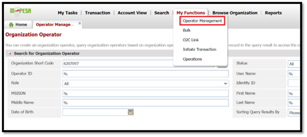

# Reversal
**Source:** https://developer.safaricom.co.ke/apis/Reversal

---

[](/)

HomeAPIsDashboardMarketplaceFAQsMiniApps

Log Out

1. Discover APIs
2. /
3. Reversals


###### Reversals

By Safaricom

Reverses an M-Pesa transaction.

POST

https://sandbox.safaricom.co.ke/mpesa/reversal/v1/request

Use API

Get Started in 3 easy steps


Open Simulator

###### DOCUMENTATION

- Overview

- How It Works

- Getting Started

- Integration Steps

- Go live

- How To

- Support

## Overview

The Reversals API enables the reversal of Customer-to-Business (C2B) transactions.

## How It Works

1. The organization sends a reversal request via the Daraja API Gateway.
2. The gateway authenticates and forwards the request to the M-PESA system.
3. M-PESA processes the reversal, refunds the customer, sends an SMS notification, and returns the result through Daraja to the organization.

> **Note:** This API is asynchronous and can be consumed over the internet, VPN, or Multiprotocol Switch.

## Getting Started

### Prerequisites

* Create a Daraja Account on the [Safaricom Developer Portal](https://daraja.safaricom.co.ke/).
* Create a sandbox app to get API credentials.
* Retrieve Consumer Key & Consumer Secret from your sandbox app on [My Apps](https://daraja.safaricom.co.ke/dashboard/myapps).
* Test data is available in the simulator section.
* For production, ensure you have a live pay bill/till number with Business Admin/Manager operators created.

### Good to Know

This API is asynchronous. This API is used to check the status of a customer to business, business to business, Business to customer, Reversal and IMT transactions that happen on M-PESA.

## Authentication

Devs gather here! You will first generate an access token to authenticate you to make the API call. See below generate access token [API](https://daraja.safaricom.co.ke/dashboard/apis?api=Authorization) here. We’ve also automated this on the simulate request section.

## Environments

| Environment | Description | URL |
| --- | --- | --- |
| Sandbox | Testing environment. | <https://sandbox.safaricom.co.ke/mpesa/reversal/v1/request> |
| Production | Live environment for real transactions. | <https://api.safaricom.co.ke/mpesa/reversal/v1/request> |

## Integration Steps

### Sequence Diagram


### Use Cases

* Reverse an erroneous payment made to your M-PESA Collection Account (Pay bill or Till number)
* Reverse double payments
* Reverse payments where services were not fulfilled

### Request Body

```json
{
    "Initiator": "apiop37",
    "SecurityCredential": "jUb+dOXJiBDui8FnruaFckZJQup3kmmCH5XJ4NY/Oo3KaUTmJbxUiVgzBjqdL533u5Q435MT2VJwr/ /1fuZvA===",
    "CommandID": "TransactionReversal",
    "TransactionID": "PDU91HIVIT",
    "Amount": "200",
    "ReceiverParty": "603021",
    "RecieverIdentifierType": "11",
    "ResultURL": "https://mydomain.com/reversal/result",
    "QueueTimeOutURL": "https://mydomain.com/reversal/queue",
    "Remarks": "Payment reversal"
}
```

### Request Parameter Definition

| Parameter | Description | Type | Required | Sample Value |
| --- | --- | --- | --- | --- |
| Initiator | Username of the API user created on M-PESA portal | String | Yes | johndoe |
| SecurityCredential | Encrypted password for the API user | String | Yes | RC6E9WDx9X2c6z3gp0oC5Th == |
| CommandID | Only 'TransactionReversal' is allowed | String | Yes | TransactionReversal |
| Amount | Transaction amount | Numeric | Yes | 100 |
| ReceiverParty | Organization Short Code | Numeric | Yes | 600997 |
| RecieverIdentifierType | Type of Organization (should be '11') | Numeric | Yes | 11 |
| Remarks | Additional information (2-100 characters) | String | Yes | Any string |
| QueueTimeOutURL | URL for timeout notification | URL | Yes | <https://mydomain.com/reversal/timedout> |
| ResultURL | URL for result notification | URL | Yes | <https://mydomain.com/reversal/result> |
| TransactionID | M-PESA Receipt Number for the transaction being reversed | String | Yes | PDU91HIVIT |

## Response Body

### Success Response

```json
{
    "OriginatorConversationID": "f1e2-4b95-a71d-b30d3cdbb7a7735297",
    "ConversationID": "AG_20210706_20106e9209f64bebd05b",
    "ResponseCode": "0",
    "ResponseDescription": "Accept the service request successfully."
}
```

### Response Parameter Definition

| Parameter | Description | Sample Value | Type |
| --- | --- | --- | --- |
| ConversationID | Unique global identifier for the transaction request | 4f31-fd2d5deb744c | String |
| OriginatorConversationID | Unique identifier for the transaction request from M-PESA | AG\_20210706\_2010ead4245 | String |
| ResponseCode | Status code (0 = success, others = error) | 0 | Numeric |
| ResponseDescription | Acknowledgment message | Accept the service request successfully | String |

## Callback Result Payload

After processing, feedback is sent to your specified `ResultURL`.

### Successful Callback

```json
{
    "Result": {
        "ResultType": 0,
        "ResultCode": 0,
        "ResultDesc": "The service request is processed successfully.",
        "OriginatorConversationID": "dad6-4c34-8787-c8cb963a496d1268232",
        "ConversationID": "AG_20211114_201018edbbf9f1582eaa",
        "TransactionID": "SKE52PAWR9",
        "ResultParameters": {
            "ResultParameter": [
                {"Key": "DebitAccountBalance", "Value": "Utility Account|KES|7722179.62|7722179.62|0.00|0.00"},
                {"Key": "Amount", "Value": 1.00},
                {"Key": "TransCompletedTime", "Value": 20211114132711},
                {"Key": "OriginalTransactionID", "Value": "SKC82PACB8"},
                {"Key": "Charge", "Value": 0.00},
                {"Key": "CreditPartyPublicName", "Value": "254705912645 - NICHOLAS JOHN SONGOK"},
                {"Key": "DebitPartyPublicName", "Value": "600992 - Safaricom Daraja 992"}
            ]
        },
        "ReferenceData": {
            "ReferenceItem": {
                "Key": "QueueTimeoutURL",
                "Value": "https://internalsandbox.safaricom.co.ke/mpesa/reversalresults/v1/submit"
            }
        }
    }
}
```

### Unsuccessful Callback

```json
{
    "Result": {
        "ResultType": 0,
        "ResultCode": "R000002",
        "ResultDesc": "The OriginalTransactionID is invalid.",
        "OriginatorConversationID": "3124-481d-b706-10bdd6fbc8e21792398",
        "ConversationID": "AG_20211114_2010573069aefb6b625a",
        "TransactionID": "SKE0000000",
        "ReferenceData": {
            "ReferenceItem": {
                "Key": "QueueTimeoutURL",
                "Value": "https://internalsandbox.safaricom.co.ke/mpesa/reversalresults/v1/submit"
            }
        }
    }
}
```

#### Response Parameter Definition

| Parameter | Description | Type | Optional | Sample Value |
| --- | --- | --- | --- | --- |
| Result | Root parameter for the result message | JSON Object | No | `{}` |
| ResultType | Status code (usually 0) | Numeric | No | 0 |
| ResultCode | Status code (0 = success, others = failure) | String | No | 0 |
| ResultDesc | Status message | String | No | The service request is processed successfully. |
| OriginatorConversationID | Unique identifier for the reversal request | String | No | 53e3-4aa8-9fe0-8fb5e4092cdd3544366 |
| ConversationID | Unique identifier from M-PESA | String | No | AG\_20210707\_20106f7a33 |
| TransactionID | M-PESA Receipt Number for the reversal request | String | No | SKE52PAWR9 |
| ResultParameters | Additional transaction details | JSON Object | Yes | `{}` |
| DebitAccountBalance | Account balances (format: `Account Type | Currency | ...`) | String |
| Amount | Transaction amount | Decimal | Yes | 1.00 |
| TransCompletedTime | Completion time (YYYYMMDDhhmmss) | String | Yes | 20211114132711 |
| OriginalTransactionID | TransactionID of the transaction to be reversed | String | Yes | SKC82PACB8 |
| Charge | Total fee amount | String | Yes | 0.00 |
| CreditPartyPublicName | Credit Party public name | String | Yes | 254705912645 - NICHOLAS JOHN SONGOK |
| DebitPartyPublicName | Debit Party public name | String | Yes | 600992 - Safaricom Daraja 992 |
| ReferenceData | Additional request details | JSON Object | Yes | `{}` |

## Result Codes

| ResultCode | ResultDesc | Explanation |
| --- | --- | --- |
| 0 | The service request is processed successfully | Request processed successfully on M-PESA. |
| R000002 | The OriginalTransactionID is invalid | The TransactionID provided is invalid or does not exist on M-PESA. |
| R000001 | The transaction has already been reversed | The TransactionID provided is already reversed. |
| 11 | The DebitParty is in an invalid state | The organization/short code account is not active. |
| 21 | The initiator is not allowed to initiate | API user lacks Org Reversals Initiator API role. |
| 2001 | The initiator information is invalid | API user credentials are invalid. |
| 2006 | Declined due to account rule | Organization/short code account is not active. |
| 2028 | Not permitted according to product assignment | Short code has no permission to perform the request. |
| 8006 | The security credential is locked | API user password is locked. |
| 1 | The balance is insufficient | Short code does not have enough money to complete the request. |

## Error Codes

### Example

```json
{
    "requestId": "94fc-460e-a970-797968bf6a851272619",
    "errorCode": "400.002.02",
    "errorMessage": "Bad Request - Invalid TransactionID"
}
```

| Parameter | Description | Sample Value | Type |
| --- | --- | --- | --- |
| requestId | Unique identifier assigned by API | 30764-19833054-1 | String |
| errorCode | Unique error code | 400.002.02 | String |
| errorMessage | Descriptive message of failure | Bad Request - Invalid TransactionID | String |

#### Error Response Codes

| errorCode | errorMessage | Mitigation | HTTP code |
| --- | --- | --- | --- |
| 404.001.03 | Invalid Access Token | Regenerate a new access token and use it before expiry. | 404 |
| 400.002.02 | Bad Request – Invalid XXXX | Ensure the request payload is set as per API documentation. | 400 |
| 404.001.01 | Resource not found | Make sure you are calling the correct API endpoint. | 404 |
| 500.001.1001 | Internal Server Error | Ensure the request payload is set as per API documentation. | 500 |
| 500.003.02 | Spike Arrest Violation | Avoid sending multiple requests that violate API TPS limit. | 500 |
| 500.003.03 | Quota Violation | Avoid sending multiple requests that violate API requests limit. | 500 |

## Next steps

## Testing

***Testing time Devs***

### Option 1: Daraja Simulator

Option 1 (Daraja Simulator): Create a new test app under apps on the main nerve bar, select Reversal app product. Once app is successfully created the simulator is automated to pick app credentials (Consumer key and Consumer Secret) and predefined test data, you can hit the simulate button.


### Option 2: Postman

Use the credentials to generate access token using the below endpoint.
- Sandbox: `https://sandbox.safaricom.co.ke/mpesa/reversal/v1/request`
- Production: `https://sandbox.safaricom.co.ke/mpesa/reversal/v1/request`
- Production: (see production details)
Initiate a transaction using the request body above.
Download the Postman collection and replace parameters with your credentials.

### GO LIVE

**Time to launch, here Dev you need help from the business teams no more Rambo stunts behind the keyboard. Some collaboration will do; a handshake to the business team in the morning it is. Wait! You can act Rambo if you are both the Business and Dev**

We’ve already tested, and finished development now attach the integration to a live pay bill/till number. Navigate to GO LIVE tab. Fill in the below fields with live data. We require a short code of a live pay bill or till number, the organization name and an M-PESA admin/manager username to successfully go live. Kindly visit our how-to section for more information on m-pesa org portal access and user creation.


Upon successful go live, production endpoints will be sent to developer email and the test sandbox app will be moved to production with production consumer key and secrets. Below is how to see the production app.

**We’ve successfully deployed dev congratulations we are now live!**

## How To

**Access to the M-PESA Organization Portal and create Users**

The M-PESA organization portal is a platform designed for businesses and organizations to manage their financial transactions through the M-PESA services.

The portal offers various features for businesses, including:

1. Transaction Management: Monitor and manage transactions, generate reports, and reconcile accounts.
2. Account Management: Manage multiple user accounts with different access levels within the organization.
3. Bulk Payments: Facilitate bulk payments to employees, suppliers, and other beneficiaries efficiently.

**Access to the M-PESA Organization Portal**


To access the Organization portal (<https://org.ke.m-pesa.com/orglogin.action>), you need to have a Business Administrator role created under your business short code (Pay Bill/ Till).

The first step before getting access, is to ensure the settlement option set to your short code is Bank via a Head Office application.

To make an application for a Head Office for your short code/Store Number kindly contact [M-PESABusiness@Safaricom.co.ke](mailto:M-PESABusiness@Safaricom.co.ke) where they will provide you with the forms to be filled.

After Head Office is created the [M-PESABusiness@Safaricom.co.ke](mailto:M-PESABusiness@Safaricom.co.ke) will also guide on the creation of the Business Administrator (username).

**How to login to M-PESA Organization Portal For the first time:**

1. Launch the link from any of the browsers: <https://org.ke.m-pesa.com>.
2. Enter the Short code which is Bulk payment number.
3. Enter the Business Administrator username received

To make an application for a Head Office for your short code/Store Number kindly contact [M-PESABusiness@Safaricom.co.ke](mailto:M-PESABusiness@Safaricom.co.ke) where they will provide you with the forms to be filled.
After Head Office is created, the [M-PESABusiness@Safaricom.co.ke](mailto:M-PESABusiness@Safaricom.co.ke) will also guide on the creation of the Business Administrator (username).

## How to login to M-PESA Organization Portal For the first time:

1. Launch the link from any of the browsers: <https://org.ke.m-pesa.com>.
2. Enter the Short code which is Bulk payment number.
3. Enter the Business Administrator username received on email.
4. Enter the first-time password received on the same email – the Password is case-sensitive (full stop is not part of the password).
5. Enter the Verification Code displayed then click login, on the Next Page.
6. Enter OTP to proceed to the change password page.
7. Enter the first-time password on email, then proceed to set a new password.
8. Confirm password, security question, and security answer one and two which are mandatory.
9. The Password must meet the password rules as instructed.
10. Submit to successfully activate the Business Administrator account.
11. After activation, you will only be entering your username, shortcode, and password verification code and entering the OTP received via SMS to log in.

## Account Types in C2B Organization

1. **MMF/WORKING/M-PESA ACCOUNT FOR ORGANIZATION**

   * When an organization wants to make a business withdrawal, the funds are transferred to this account before the withdrawal request is made.
2. **UTILITY ACCOUNT**

   * Payments from customers are credited into the utility account.
3. **CHARGES PAID ACCOUNT**

   * For payments received from customers, depending on the tariff, a charge is levied on the Organization or is split between the organization and the customer. The charges paid account is debited and always accrues a negative balance which has to be settled before an organization can make a withdrawal request.
4. **ORGANIZATION SETTLEMENT ACCOUNT**

   * This account does the calculations for the organization operator when s/he initiates a revenue settlement. This account settles the charges paid account and then moves the balance from the Utility Account to the MMF account automatically. You will notice that the transaction type “Move funds from Utility to MMF” is no longer available as the revenue settlement process takes care of this.

## Various Roles under the portal

### Business Administrator role

The Business Administrator role is crucial for managing and overseeing user activities within the portal.

**Responsibilities of a Business Administrator:**

1. Create other system users and give them roles depending on what he/she wants them to do within the portal. The roles include:
   * A Business Web Operator who can initiate transactions, access statements, and check balance.
   * A business manager.
   * A Business Auditor – View Only/ Read Only Rights.
2. Not able to view transactions.
3. User created by Safaricom ([M-PESABusiness@Safaricom.co.ke](mailto:M-PESABusiness@Safaricom.co.ke)).

### Business Manager

The Business manager approves transactions, checks balances, and access statements.

**Responsibilities of a Business Manager:**

1. The user can View statements.
2. The user can initiate transactions.
3. The user can Approve/reject other transactions.
4. The user can withdraw funds from M-PESA.

**Proceed as below to create a business manager:**

1. Log in the Organization portal as the Business administrator.
2. Select operators.


3. Then click the add option.
4. It will take you to a new page where you will enter the username of the operator.
5. Select access channel as Web.


6. Then select web profile default rule profile.
7. Then assign role...Business Manager and Set Restricted ORG API PASSWORD.


8. Enter the KYC information of the operator then submit.

### API user creation

**Proceed as below to create an API Operator:**

1. Log in as the Business administrator.
2. Select operators.


3. Then click the add option.
4. It will take you to a new page where you will enter the username of the API initiator.
5. Select access channel as API.
6. Then select web profile default rule profile.
7. Then assign role...look for the ORG B2C API initiator, Balance Query ORG API, Transaction Status query ORG API roles.


8. Enter the KYC information of the operator then submit.

**Here is how to set the password for the API user:**

1. Login as User with the Set Restrict Password Role i.e. The Business Manager.



2. Click on My Functions, Then Operator Management.
3. Enter the API username to search after it populates the API user, At the end click on operations.
4. Then click on set password avoid such (@ or.) in the setting of this password.


### Various API roles:

| API | API Role Assignment |
| --- | --- |
| B2C | ORG B2C API Initiator. |
| Business Pay Bill | Business Paybill Org API initiator. |
| Business Buy Goods | Business Buy Goods Org API initiator. |
| Transaction Status | Transaction Status query ORG API. |
| Reversals | Org Reversals Initiator. |
| Tax Remittance | Tax Remittance to KRA API. |
| Set Password role | Set Restricted ORG API PASSWORD. |

## How to apply for a live pay bill number/till number or B2C Account

Apply here: [M-PESABusiness@Safaricom.co.ke](mailto:M-PESABusiness@Safaricom.co.ke)

## Support

### Chatbot

Developers can get instant responses using the Daraja Chatbot for both development and production support.

### Production Issues & Incident Management

For production support and incident management, use:

* **Incident Management Page:** Visit the [Incident Management](https://daraja.safaricom.co.ke/dashboard/incidentmanagement) page.
* **Email:** Reach out to API support at [apisupport@safaricom.co.ke](mailto:apisupport@safaricom.co.ke).

## FAQs

### Why am I not receiving callbacks on my Reversal ResultURL?

* Ensure your callback endpoint is reachable over the internet and uses a public IP or domain.

### What should I do if I encounter an invalid access token error?

* Ensure the access token has not expired (expires hourly).
* Use the correct consumer key and secret.

### How can I determine if the Reversal request was successful?

* The API is asynchronous. You receive an acknowledgement first, and the actual result is sent to your `ResultURL`. A successful reversal has `ResultCode` 0.

### What API role should I assign to my API user for Reversal requests?

* Assign the **Org Reversals Initiator API** role.

### How do I activate a pending API user?

* Set their password via the M-PESA portal as a user with the Set Restricted ORG API PASSWORD role.

### Why am I receiving an ‘initiator information is invalid’ error?

* Check API user credentials, username, and password encryption.

### Why am I receiving ‘The security credential is locked’ error?

* Multiple invalid credential attempts lock the password. Unlock via the Business Administrator.

### What should I do to resolve an ‘Invalid API call as no apiproduct match found’ error?

* Ensure the Reversal product is enabled on your Daraja application and you are using the correct endpoint.

### Can I reverse a B2C transaction using the Reversal API?

* No. B2C reversals are done manually on the M-PESA portal.

### What could cause 'Bad Request - Invalid RecieverIdentifierType’ error?

* Wrong Content-Type header, incorrect parameter name, or invalid/missing value.

### API reversal failing due to 'initiator information is invalid'?

* Use the correct API user (access channel-API) and ensure the user is active.

### What is the process of creating an Initiator?

* Create a Business Manager, then an API operator, and set the API user's password.

### How do I generate Security Credential?

* Encrypt the base64 encoded initiator password with M-Pesa’s public key certificate using RSA and PKCS #1.5 padding.

### What is a short code?

* Unique number allocated to a pay bill or buy goods organization for receiving payments.

### How will I log in to the M-PESA portal?

* Use the provided link, shortcode, username, and password. Follow the prompts to set up your account.

### What should I do when the Business Administrator role is Dormant?

* Request activation by emailing [M-PESABusiness@Safaricom.co.ke](mailto:M-PESABusiness@Safaricom.co.ke).

Daraja 3.0

Daraja 3.0 is a web platform that offers access to Safaricom and M-PESA APIs that creates a bridge for payment integration to web and mobile apps. By connecting to our APIs, you open a world of possibilities to you and your clients. Together, we can transform lives.

Discover more

[Privacy Policy](/terms)

[Terms and Conditions](/terms)

Copyright@Safaricom PLC 2025

Ask Daraja about anything 😊


Logout of Daraja?

If you Logout, you will be required to Login again to access some features.

CancelLogout