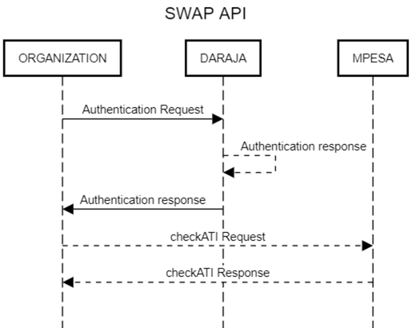

# Swap
**Source:** https://developer.safaricom.co.ke/apis/Swap

---

[](/)

HomeAPIsDashboardMarketplaceFAQsMiniApps

Log Out

1. Discover APIs
2. /
3. Swap


###### Swap

By Safaricom

This API enables the partners to query the last date a sim card was swapped.

POST

https://sandbox.safaricom.co.ke/imsi/v2/checkATI

Use API

Get Started in 3 easy steps


Open Simulator

###### DOCUMENTATION

- Overview

- Onboarding

- More details

- How It Works

- Getting Started

- Integration Steps

- Go live

- How To

- Support

## Overview

Over the years, mobile banking customers have been the target of social engineering through various ways, majority of fraud happening through sim swap. With the introduction of IMSI and SWAP API Products, the fraud cases perpetrated through SIM swap are expected to reduce. This will cater for both mobile banking and internet banking services via API.

## Onboarding

To be onboarded partners can either write to [apisupport@safaricom.co.ke](mailto:apisupport@safaricom.co.ke) or reach out to their account manager with the request to be onboarded to the SWAP API. The partner will have to make commercial agreements after which they will be onboarded to the sandbox and production environments.

## More details

### 1. Description

This API enables the partners to query the last date a sim card was swapped. If the specified SIM was swapped more than 3 months ago, the API returns a default date of 01-01-1900.

### 2. Usage Fee

An initial connection fee of KES 50,000 applies, with the first 200,000 requests free and KES 1 charged per request thereafter.

## How It Works

* Organization sends an API request to Daraja with the customers phone number
* Daraja authenticates the API call and towards the request to M-PESA
* M-PESA returns the last swap date to Daraja which forwards the response to organization system

## Getting Started

### Prerequisites

1. Create a Daraja Account on [Safaricom Developer Portal](https://daraja.safaricom.co.ke/).
2. Create a sandbox app in the portal to get API credentials.
3. Retrieve Consumer Key & Consumer Secret from your sandbox app on [My Apps](https://daraja.safaricom.co.ke/dashboard/myapps).
4. **Test data:** Available on the simulator section.
5. Signed commercial agreement

### Good to Know

This is a commercial API.
This API is asynchronous. You can consume this API over the internet

#### Get Auth Token

Devs gather here!  
You will first generate an access token to authenticate you to make the API call. See below generate access token API [API](https://daraja.safaricom.co.ke/dashboard/apis?api=Authorization) here. We’ve also automated this on the simulate request section.

## Environments

| Environment | Description | URL |
| --- | --- | --- |
| Sandbox | Testing environment. | <https://sandbox.safaricom.co.ke/imsi/v2/checkATI> |
| Production | Live environment for real transactions. | <https://api.safaricom.co.ke/imsi/v2/checkATI> |

> Note: Before making any API request, you must first obtain authorization by generating an access token from the Authorization API to successfully complete the call.

## Integration Steps

### Sequence Diagram



## Use Cases

* Due diligence for risky mobile and Internet banking transactions for bank/fintech customers
* Onboarding to Mobile banking service for new and old customers
* Cheque confirmations – OPS check if line was swapped before clearing a cheque.

**Request Body**

```json
{
    "customerNumber": "254722000000"
}
```

**Request Parameter Definition**

| Name | Description | Parameter Type | Possible Values |
| --- | --- | --- | --- |
| Customer Number | The customer MSISDN whose network age is to be determined | Numeric | MSISDN (12 digits Mobile Number) e.g. 2547XXXXXXXX |

**Response Body**

```json
{
    "requestRefID": "4277-415525-1",
    "responseCode": "200",
    "responseDesc": "Success",
    "lastSwapDate": "01-01-1900 00:00"
}
```

**Response Parameter Definition**

| Name | Description | Parameter Type | Possible Values |
| --- | --- | --- | --- |
| requestRefID | The unique request ID returned by the API for each request made | String | 4277-415525-1 |
| responseCode | A Numeric status code that indicates the status of the transaction submission. 200 means successful submission and any other code means an error occurred. | Numeric | 200 |
| responseDesc | This is a message from the API that gives the status of the request processing and usually maps to a specific result code value. | String | Success |
| lastSwapDate | This is a string representing the date in which the mobile number was last swapped. If the specified SIM was swapped more than 3 months ago, the API returns a default date of 01-01-1900 | String | 01-01-1900 00:00 |

## Result Codes

| Http status code | Error | Description |
| --- | --- | --- |
| 400 | Bad Request | The server could not understand the request due to invalid syntax. |
| 401 | Unauthorized | The client must authenticate itself to get the requested response. |
| 403 | Forbidden | The client does not have access rights to the content |
| 404 | Not Found | The server can not find the requested resource. |
| 405 | Method Not Allowed | The request method is known by the server but has been disabled and cannot be used. |
| 408 | Request Timeout | The server did not receive a complete request message within the time it was prepared to wait. |
| 429 | Too Many Requests | The user has sent too many requests in a given amount of time ("rate limiting"). |
| 500 | Internal Server Error | The server has encountered a situation it doesn't know how to handle. |
| 501 | Not Implemented | The request method is not supported by the server and cannot be handled. |
| 502 | Bad Gateway | The server, while working as a gateway to get a response needed to handle the request, got an invalid response. |
| 503 | Service Unavailable | The server is not ready to handle the request. Common causes are a server that is down for maintenance or that is overloaded. |
| 504 | Gateway Timeout | The server, while acting as a gateway or proxy, did not get a response in time |

## Next steps

## Testing

***Testing time Devs***

### Option 1: Daraja Simulator

Create a new test app under apps on the main nerve bar, select transaction status product. Once app is successfully created the simulator is automated to pick app credentials (Consumer key and Consumer Secret) and predefined test data, you can hit the simulate button.


### Option 2: Postman

Use the credentials to generate access token using the below endpoint.

* Sandbox: <https://sandbox.safaricom.co.ke/mpesa/transactionstatus/v1/query>
* Production: <https://sandbox.safaricom.co.ke/mpesa/transactionstatus/v1/query>
  Initiate Transaction status using the above transaction status request body. Download the availed postman collection. Ensure to replace the parameters with actual credentials.

## Go Live

**Time to launch, here Dev you need help from the business teams no more Rambo stunts behind the keyboard. Some collaboration will do; a handshake to the business team in the morning it is. Wait! You can act Rambo if you are both the Business and Dev**

We’ve already tested, and finished development now attach the integration to live production environment  
For Go live support kindly email [apisupport@safaricom.co.ke](mailto:apisupport@safaricom.co.ke).

### Requirements for Onboarding

To proceed with onboarding, you will need to:

1. **Submit company registration details**  
   These details are required to create your account and facilitate billing.
2. **Provide a signed commercial agreement**  
   Ensure the commercial agreement document is signed and submitted as part of the onboarding process.

## Support

### Chatbot

Developers can get instant responses using the Daraja Chatbot for both development and production support.

### Production Issues & Incident Management

For production support and incident management, use:

* **Incident Management Page:** Visit the [Incident Management](https://daraja.safaricom.co.ke/dashboard/incidentmanagement) page.
* **Email:** Reach out to API support at [apisupport@safaricom.co.ke](mailto:apisupport@safaricom.co.ke).

### FAQs

1. **What is the SWAP API?**  
   Description: The SWAP API allows users to query the last Sim SWAP date of a phone number. The API acts as a security enhancement, preventing fraud cases.
2. **How does the SWAP API work?**  
   Sequence Diagram: The sequence diagram illustrates the interaction between the client application and the SWAP API.
3. **What should I do if I encounter an error?**  
   Error Handling:

   * Check the responseCode and responseDesc for details on the error.
   * Ensure that all parameters are correctly formatted and valid.
   * Retry the request or contact support if the issue persists.
4. **How can I get support?**  
   Support Contact: For further assistance, use ask Daraja assistant. Raise an incident on self services or email [apisupport@safaricom.co.ke](mailto:apisupport@safaricom.co.ke).
5. **Who is eligible for this API?**  
   Any registered company can apply. While we recommend having an M-PESA Paybill or Till number, it is not mandatory and depends on your business model.

Daraja 3.0

Daraja 3.0 is a web platform that offers access to Safaricom and M-PESA APIs that creates a bridge for payment integration to web and mobile apps. By connecting to our APIs, you open a world of possibilities to you and your clients. Together, we can transform lives.

Discover more

[Privacy Policy](/terms)

[Terms and Conditions](/terms)

Copyright@Safaricom PLC 2025

Ask Daraja about anything 😊


Logout of Daraja?

If you Logout, you will be required to Login again to access some features.

CancelLogout