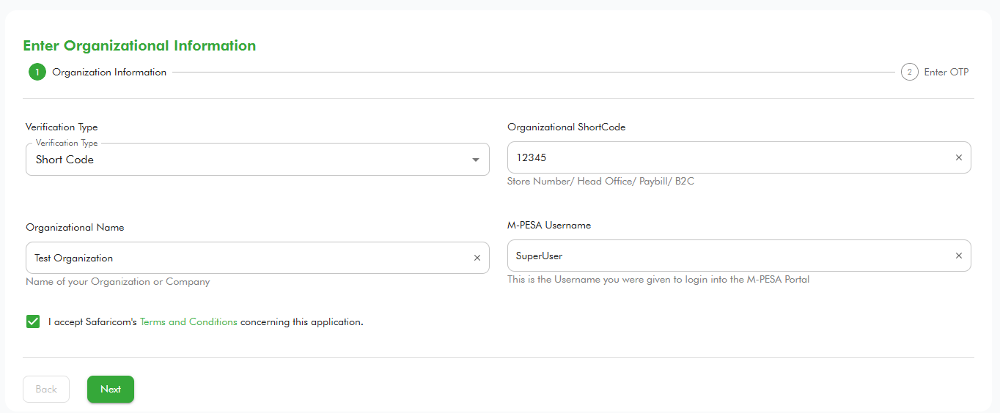
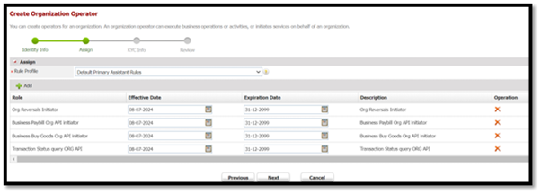

# TransactionStatus
**Source:** https://developer.safaricom.co.ke/apis/TransactionStatus

---

[](/)

HomeAPIsDashboardMarketplaceFAQsMiniApps

Log Out

1. Discover APIs
2. /
3. Transaction Status


###### Transaction Status

By Safaricom

Check the status of a transaction

POST

https://sandbox.safaricom.co.ke/mpesa/transactionstatus/v1/query

Use API

Get Started in 3 easy steps


Open Simulator

###### DOCUMENTATION

- Overview

- How It Works

- Getting Started

- Integration Steps

- Go live

- How To

- Support

## Overview

The Transaction status API can be used as a secondary reconciliation mechanism when Callbacks are not received. To check the status of a transaction, you are required to have either an M-Pesa Receipt number or an Originator Conversation ID of the transaction.

## How It Works

Organization sends the API request to check the status of an M-PESA transaction to Daraja, Daraja Authenticates the API call and pushes the request to M-PESA system. MPESA checks transaction status and responds to Daraja with the status. Daraja pushes the response back to the organization.

> **Note:** This API is asynchronous and can be consumed over the internet, VPN, or Multiprotocol Switch.

## Getting Started

### Prerequisites

1. Create a Daraja Account on [Safaricom Developer Portal](https://daraja.safaricom.co.ke/).
2. Create a sandbox app in the portal to get API credentials.
3. Retrieve Consumer Key & Consumer Secret from your sandbox app on [My Apps](https://daraja.safaricom.co.ke/dashboard/myapps).

### Good to Know

This API is asynchronous. This API is used to check the status of a customer to business, business to business, Business to customer, Reversal and IMT transactions that happen on M-PESA.

#### Get Auth Token

Devs gather here! You will first generate an access token to authenticate you to make the API call. See below generate access token [API](https://daraja.safaricom.co.ke/dashboard/apis?api=Authorization) here. We’ve also automated this on the simulate request section.

## Environments

| Environment | Description | URL |
| --- | --- | --- |
| Sandbox | Testing environment. | <https://sandbox.safaricom.co.ke/mpesa/transactionstatus/v1/query> |
| Production | Live environment for real transactions. | <https://api.safaricom.co.ke/mpesa/transactionstatus/v1/query> |

## Integration Steps

### Sequence Diagram


### Use Cases

Used to check status of a transaction by organization/merchant especially for transactions that have delayed callback. Helping them make an informed decision where the transaction was completed or not.

**Request Body**

```json
{
    "Initiator": "testapiuser",
    "SecurityCredential": "ClONZiMYBpc65lmpJ7nvnrDmUe0WvHvA5QbOsPjEo92B6IGFwDdvdeJIFL0kgwsEKWu6SQKG4ZZUxjC",
    "Command ID": "TransactionStatusQuery",
    "Transaction ID": "NEF61H8J60",
    "OriginalConversationID": "7071-4170-a0e5-8345632bad442144258",
    "PartyA": "600782",
    "IdentifierType": "4",
    "ResultURL": "http://myservice:8080/transactionstatus/result",
    "QueueTimeOutURL": "http://myservice:8080/timeout",
    "Remarks": "OK",
    "Occasion": "OK"
}
```

**Request Parameter Definition**

| Name | Description | Type | Sample Values |
| --- | --- | --- | --- |
| CommandID | Takes only the 'TransactionStatusQuery' Command ID. | String | TransactionStatusQuery |
| PartyA | Organization/MSISDN receiving the transaction | Numeric | Short code (6-9 digits) MSISDN (12 Digits) |
| IdentifierType | Type of organization receiving the transaction | Numeric | 4 – Organization shortcode |
| Remarks | Comments that are sent along with the transaction | String | A sequence of characters up to 100 |
| Initiator | The name of the initiator initiating the request. | Alpha-Numeric | This is the credential/username used to authenticate the transaction request |
| SecurityCredential | Encrypted credential of the user getting transaction status | String | Encrypted password for the initiator to authenticate the transaction request |
| QueueTimeoutURL | The path that stores information of timeout transaction | URL | <https://ip:port> or domain: port/path |
| TransactionID | Unique identifier to identify a transaction on Mpesa. Also known as the Mpesa Receipt Number. | Alpha-Numeric | LXXXXXX1234 |
| ResultURL | The path that stores information of a transaction. | URL | <https://ip:port/path> or domain:port/path |
| Occasion | Optional parameter | String | A sequence of characters up to 100 |
| OriginalConversationID | This is the Originator Conversation ID of the transaction whose status is being checked. | String | 7071-4170-a0e5-8345632bad442144258 |

**Response Body**

```json
{
    "OriginatorConversationID": "1236-7134259-1",
    "ConversationID": "AG_20210709_1234409f86436c583e3f",
    "ResponseCode": "0",
    "ResponseDescription": "Accept the service request successfully."
}
```

**Response Parameter Definition**

| Name | Description | Parameter Type | Sample Value |
| --- | --- | --- | --- |
| OriginatorConversationID | The unique request ID for tracking a transaction | Alpha-Numeric | Alpha-Numeric String of less than 20 characters e.g.: 1236-7134259-1 |
| ConversationID | The unique request ID returned my M-PESA for each request made | Alpha-Numeric | Alpha Numeric String of less than 20 characters e.g.: AG\_20210709\_1234409f86436c583e3f |
| ResponseCode | The numeric status code indicates the status transaction processing. 0 means success and any other code means an error occurred or the transaction failed. | Number | 0 or 1 or 2001 or 21 |
| ResponseDescription | Response description message | String | Accept the service request successfully |

**Callback payload**

```json
{
    "Result": {
        "ConversationID": "AG_20180223_0000493344ae97d86f75",
        "OriginatorConversationID": "3213-416199-2",
        "ReferenceData": {
            "ReferenceItem": {
                "Key": "Occasion"
            }
        },
        "ResultCode": 0,
        "ResultDesc": "The service request is processed successfully.",
        "ResultParameters": {
            "ResultParameter": [
                {
                    "Key": "DebitPartyName",
                    "Value": "600310 - Safaricom333"
                },
                {
                    "Key": "DebitPartyName",
                    "Value": "254708374149 - John Doe"
                },
                {
                    "Key": "OriginatorConversationID",
                    "Value": "3211-416020-3"
                },
                {
                    "Key": "InitiatedTime",
                    "Value": "20180223054112"
                },
                {
                    "Key": "DebitAccountType",
                    "Value": "Utility Account"
                },
                {
                    "Key": "DebitPartyCharges",
                    "Value": "Fee For B2C Payment|KES|22.40"
                },
                {
                    "Key": "TransactionReason"
                },
                {
                    "Key": "ReasonType",
                    "Value": "Business Payment to Customer via API"
                },
                {
                    "Key": "TransactionStatus",
                    "Value": "Completed"
                },
                {
                    "Key": "FinalisedTime",
                    "Value": "20180223054112"
                },
                {
                    "Key": "Amount",
                    "Value": "300"
                },
                {
                    "Key": "ConversationID",
                    "Value": "AG_20180223_000041b09c22e613d6c9"
                },
                {
                    "Key": "ReceiptNo",
                    "Value": "MBN31H462N"
                }
            ]
        },
        "ResultType": 0,
        "TransactionID": "MBN0000000"
    }
}
```

**Results Parameter Definition**

| Name | Description | Type | Sample Values |
| --- | --- | --- | --- |
| ConversationID | The unique identifier generated by M-PESA for a request. | String | AG\_20180223\_0000493344ae97d86f75 |
| OriginatorConversationID | The unique identifier of the request message. This is auto-generated by M-PESA for third-party/Organizations. Its value comes from the response message. It can be used to check the status of the transaction. | String | 3213-416199-2 |
| ReferenceData | It is used to carry some reference data that M-PESA need not analyse but need to record into the transaction log. | ReferenceData | n/a |
| ReferenceItem | It is used to carry some reference data that MM needs not analyse but needs to record in the transaction log. | ParameterType | n/a |
| ResultCode | It indicates whether M-PESA processes the request successfully or not. The max length is 10. | String | 0 |
| ResultDesc | Its value is a description of the parameter Result Code. The max length is 1024. | String | The service request is processed successfully. |
| ResultParameters | It is used to carry specific parameters for reversals API. | n/a | n/a |
| Key | It indicates a parameter name. | String | DebitPartyName |
| Value | It indicates a parameter value. | String | 600310 - Safaricom333 |
| ResultType | 0: completed 1: waiting for further messages. | Integer | 0 |
| TransactionID | It’s only for transactions. When the request is a transaction request, M-PESA will generate a unique identifier for the transaction. | String | MBN0000000 |

## Error Codes

| Error | Possible Cause | Mitigation |
| --- | --- | --- |
| 500.003.1001 Internal Server Error | Server failure | Make sure everything on your side is correctly set up as per the API and you are calling the correct endpoints plus your server is running as expected |
| 400.003.01 Invalid Access Token | Might be using a wrong or expired access token | Regenerate a new token and use it before expiry, if you are copy-pasting manually make sure you’ve pasted the correct access token. |
| 400.003.02 Bad Request | The server cannot process the request because something is missing | Make sure everything on your side is correctly set up as per the API documentation. |
| 500.003.03 Error Occurred: Quota Violation | You are sending multiple requests that violate M-PESA transaction per second speed | For testing, send a reasonable number of requests if possible one request at a time. |
| 500.003.02 Error Occurred: Spike Arrest Violation | Your endpoints constantly generate a lot of errors that lead to a spike that affects our M-PESA performance | Make sure your endpoints/server is running and responding as expected by M-PESA and accessible over the internet. |
| 404.003.01 Resource not found | The requested resource could not be found but may be available in the future. Subsequent requests by the client are permissible. | Make sure you are calling the correct M-PESA API endpoint. |
| 404.001.04 Invalid Authentication Header | All M-PESA APIs on the Daraja platform are POST except Authorization API which is GET. If you’ve possibly misplaced the headers, you will get the error. | All M-PESA API requests on the Daraja platform are POST requests except Authorization API which is a GET request. |
| 400.002.05 Invalid Request Payload | Your request body is not properly drafted | Make sure you are submitting the correct request payload as shown in the sample request body for all the APIs, avoid typo errors. |

## Response codes

| Response Code | Response Description |
| --- | --- |
| 0 | Success |

## Result codes

| Result code | Result Description |
| --- | --- |
| 0 | Success |
| SFC\_IC0003 | The operator does not exist. |

## Next steps

### TESTING

***Testing time Devs***

### Option 1: Daraja Simulator

Create a new test app under apps on the main nerve bar, select transaction status product. Once app is successfully created the simulator is automated to pick app credentials (Consumer key and Consumer Secret) and predefined test data, you can hit the simulate button.


### Option 2: Postman

Use the credentials to generate access token using the below endpoint.

* Sandbox: `https://sandbox.safaricom.co.ke/mpesa/transactionstatus/v1/query`
* Production: `https://sandbox.safaricom.co.ke/mpesa/transactionstatus/v1/query`
  Initiate Transaction status using the above transaction status request body. Download the availed postman collection. Ensure to replace the parameters with actual credentials.

### GO LIVE

**Time to launch, here Dev you need help from the business teams no more Rambo stunts behind the keyboard. Some collaboration will do; a handshake to the business team in the morning it is. Wait! You can act Rambo if you are both the Business and Dev**

We’ve already tested, and finished development now attach the integration to a live pay bill/till number. Navigate to GO LIVE tab. Fill in the below fields with live data. We require a short code of a live pay bill or till number, the organization name and an M-PESA admin/manager username to successfully go live. Kindly visit our how-to section for more information on m-pesa org portal access and user creation.



Upon successful go live, production endpoints will be sent to developer email and the test sandbox app will be moved to production with production consumer key and secrets. Below is how to see the production app.

**We’ve successfully deployed dev congratulations we are now live!**

## How To

**Access to the M-PESA Organization Portal and create Users**

The M-PESA organization portal is a platform designed for businesses and organizations to manage their financial transactions through the M-PESA services.

The portal offers various features for businesses, including:

1. Transaction Management: Monitor and manage transactions, generate reports, and reconcile accounts.
2. Account Management: Manage multiple user accounts with different access levels within the organization.
3. Bulk Payments: Facilitate bulk payments to employees, suppliers, and other beneficiaries efficiently.

**Access to the M-PESA Organization Portal**


To access the Organization portal (<https://org.ke.m-pesa.com/orglogin.action>), you need to have a Business Administrator role created under your business short code (Pay Bill/ Till).

The first step before getting access, is to ensure the settlement option set to your short code is Bank via a Head Office application.

To make an application for a Head Office for your short code/Store Number kindly contact [M-PESABusiness@Safaricom.co.ke](mailto:M-PESABusiness@Safaricom.co.ke) where they will provide you with the forms to be filled.

After Head Office is created the [M-PESABusiness@Safaricom.co.ke](mailto:M-PESABusiness@Safaricom.co.ke) will also guide on the creation of the Business Administrator (username).

**How to login to M-PESA Organization Portal For the first time:**

1. Launch the link from any of the browsers: <https://org.ke.m-pesa.com>.
2. Enter the Short code which is Bulk payment number.
3. Enter the Business Administrator username received

To make an application for a Head Office for your short code/Store Number kindly contact [M-PESABusiness@Safaricom.co.ke](mailto:M-PESABusiness@Safaricom.co.ke) where they will provide you with the forms to be filled.
After Head Office is created, the [M-PESABusiness@Safaricom.co.ke](mailto:M-PESABusiness@Safaricom.co.ke) will also guide on the creation of the Business Administrator (username).

## How to login to M-PESA Organization Portal For the first time:

1. Launch the link from any of the browsers: <https://org.ke.m-pesa.com>.
2. Enter the Short code which is Bulk payment number.
3. Enter the Business Administrator username received on email.
4. Enter the first-time password received on the same email – the Password is case-sensitive (full stop is not part of the password).
5. Enter the Verification Code displayed then click login, on the Next Page.
6. Enter OTP to proceed to the change password page.
7. Enter the first-time password on email, then proceed to set a new password.
8. Confirm password, security question, and security answer one and two which are mandatory.
9. The Password must meet the password rules as instructed.
10. Submit to successfully activate the Business Administrator account.
11. After activation, you will only be entering your username, shortcode, and password verification code and entering the OTP received via SMS to log in.

## Account Types in C2B Organization

1. **MMF/WORKING/M-PESA ACCOUNT FOR ORGANIZATION**

   * When an organization wants to make a business withdrawal, the funds are transferred to this account before the withdrawal request is made.
2. **UTILITY ACCOUNT**

   * Payments from customers are credited into the utility account.
3. **CHARGES PAID ACCOUNT**

   * For payments received from customers, depending on the tariff, a charge is levied on the Organization or is split between the organization and the customer. The charges paid account is debited and always accrues a negative balance which has to be settled before an organization can make a withdrawal request.
4. **ORGANIZATION SETTLEMENT ACCOUNT**

   * This account does the calculations for the organization operator when s/he initiates a revenue settlement. This account settles the charges paid account and then moves the balance from the Utility Account to the MMF account automatically. You will notice that the transaction type “Move funds from Utility to MMF” is no longer available as the revenue settlement process takes care of this.

## Various Roles under the portal

### Business Administrator role

The Business Administrator role is crucial for managing and overseeing user activities within the portal.

**Responsibilities of a Business Administrator:**

1. Create other system users and give them roles depending on what he/she wants them to do within the portal. The roles include:
   * A Business Web Operator who can initiate transactions, access statements, and check balance.
   * A business manager.
   * A Business Auditor – View Only/ Read Only Rights.
2. Not able to view transactions.
3. User created by Safaricom ([M-PESABusiness@Safaricom.co.ke](mailto:M-PESABusiness@Safaricom.co.ke)).

### Business Manager

The Business manager approves transactions, checks balances, and access statements.

**Responsibilities of a Business Manager:**

1. The user can View statements.
2. The user can initiate transactions.
3. The user can Approve/reject other transactions.
4. The user can withdraw funds from M-PESA.

**Proceed as below to create a business manager:**

1. Log in the Organization portal as the Business administrator.
2. Select operators.


3. Then click the add option.
4. It will take you to a new page where you will enter the username of the operator.
5. Select access channel as Web.


6. Then select web profile default rule profile.
7. Then assign role...Business Manager and Set Restricted ORG API PASSWORD.


8. Enter the KYC information of the operator then submit.

### API user creation

**Proceed as below to create an API Operator:**

1. Log in as the Business administrator.
2. Select operators.


3. Then click the add option.
4. It will take you to a new page where you will enter the username of the API initiator.
5. Select access channel as API.
6. Then select web profile default rule profile.
7. Then assign role...look for the ORG B2C API initiator, Balance Query ORG API, Transaction Status query ORG API roles.



8. Enter the KYC information of the operator then submit.

**Here is how to set the password for the API user:**

1. Login as User with the Set Restrict Password Role i.e. The Business Manager.


2. Click on My Functions, Then Operator Management.
3. Enter the API username to search after it populates the API user, At the end click on operations.
4. Then click on set password avoid such (@ or.) in the setting of this password.


### Various API roles:

| API | API Role Assignment |
| --- | --- |
| B2C | ORG B2C API Initiator. |
| Business Pay Bill | Business Paybill Org API initiator. |
| Business Buy Goods | Business Buy Goods Org API initiator. |
| Transaction Status | Transaction Status query ORG API. |
| Reversals | Org Reversals Initiator. |
| Tax Remittance | Tax Remittance to KRA API. |
| Set Password role | Set Restricted ORG API PASSWORD. |

## How to apply for a live pay bill number/till number or B2C Account

Apply here: [M-PESABusiness@Safaricom.co.ke](mailto:M-PESABusiness@Safaricom.co.ke)

## Support

### Chatbot

Developers can get instant responses using the Daraja Chatbot for both development and production support.

### Production Issues & Incident Management

For production support and incident management, use:

* **Incident Management Page:** Visit the [Incident Management](https://daraja.safaricom.co.ke/dashboard/incidentmanagement) page.
* **Email:** Reach out to API support at [apisupport@safaricom.co.ke](mailto:apisupport@safaricom.co.ke).

### FAQs

1. **How can I test Transaction status Api?**

   * Step 1. Access your app credential (Consumer key and Consumer Secret) on Daraja.
   * Step 2. Use the credentials to generate access token using the below endpoint.
     + Sandbox: <https://sandbox.safaricom.co.ke/mpesa/transactionstatus/v1/query>
     + Production: <https://sandbox.safaricom.co.ke/mpesa/transactionstatus/v1/query>
   * Step 3. Initiate Transaction status using the below payload. Ensure to replace the parameters with actual credentials. Key parameters: TransactionID or OriginalConversationID and PartyA.
2. **Can I query B2C, B2b transactions?**

   * Transaction Status can be used on any of the following, C2B, B2B, B2C, IMT or Reversal transactions.
3. **What are the different transaction statuses?**

   * All transactions will normally have three statuses:
     + Initiated - pending revalidation,
     + Authorized/Pending Authorized - depended on the validation requirements of the credit party and instructions that may have to be waited upon from the partner in the event the validation endpoint is unavailable.
     + Final status (Cancelled, Declined, Completed or Expired) - dependent on failed pre-validation or validation, and/or delay of the feedback from the credit party for beyond the threshold set.
4. **API reversal failing due to an error 'initiator information is invalid'?**

   * Kindly use the correct API user (access channel-API) to initiate the requests. login on MPESA portal and validate the correct username for the API operator. Also confirm the API User is in an Active state (not dormant).
5. **What is the process of creating an Initiator?**

   * Steps to creating API operator/initiator and setting their password:
     + **Step One: Create a Business Manager**
       - Login on MPESA portal, [https://org.ke.m-pesa.com](https://org.ke.m-pesa.com/) as the Business administrator.
       - Select operators.
       - Then click the add option.
       - It will take you to a new page where you will enter the username of the operator.
       - Select access channel as Web.
       - Then select web profile default rule profile.
       - Then assign role...Business Manager and Set Restricted ORG API PASSWORD.
       - Enter the KYC information of the operator then submit.
     + **Step Two: Create an API operator.**
       - Log in as the Business administrator.
       - Select operators.
       - Then click the add option: It will take you to a new page where you will enter the username of the API initiator.
       - Select access channel as API.
       - Then select web profile default rule profile.
       - Then assign role...look for the ORG B2C API initiator, Balance Query ORG API, Transaction Status query ORG API roles.
       - Enter the KYC information of the operator then submit.
     + **Step Three: Setting the API Users password.**
       - Here is how to set the password for the API user.
       - Login as User with the Set Restrict Password Role i.e. The Business Manager.
       - Click on My Functions, Then Operator Management.
       - Enter the API username to search after it populates the API user, At the end click on operations.
       - Then click on set password avoid such (@ or.) in the setting of this password.
       - ***Password set is valid for 90 days.***
6. **How do I generate Security Credential?**

   * M-Pesa Core authenticates a transaction by decrypting the security credentials. Security credentials are generated by encrypting the base64 encoded initiator password with M-Pesa’s public key, a X509 certificate.
   * The algorithm for generating security credentials is as follows:
     + Write the unencrypted password into a byte array.
     + Encrypt the array with the M-Pesa public key certificate. Use the RSA algorithm, and use PKCS #1.5 padding (not OAEP), and add the result to the encrypted stream.
     + Convert the resulting encrypted byte array into a string using base64 encoding. The resulting base64 encoded string is the security credential.
7. **What is a short code?**

   * A short code is the unique number that is allocated to a pay bill or buy goods organization through which they will be able to receive customer payment. It could be a Pay bill, Buy Goods or Till Number.
8. **How will I log in to the M-PESA portal?**

   * For the first time login to M-PESA Organization portal:
     1. Launch the link from any of the browsers: <https://org.ke.m-pesa.com>.
     2. Enter the Shortcode which is Bulk payment number.
     3. Enter the Business Administrator username received on email.
     4. Enter the first-time password received on the same email – the Password is case-sensitive (full stop is not part of the password).
     5. Enter the Verification Code displayed then click login, on the Next Page.
     6. Enter OTP to proceed to the change password page.
     7. Enter the first-time password on email, then proceed to set a new password.
     8. Confirm password, security question, and security answer one and two which are mandatory.
     9. The Password must meet the password rules as instructed.
     10. Submit to successfully activate the Business Administrator account.
     11. After activation, you will only be entering your username, shortcode, and password verification code and entering the OTP received via SMS to log in.
9. **What should I do when the Business Administrator role is Dormant?**

   * When the Business Administrator role is dormant, you can request activation by writing an email to our team at [M-PESABusiness@Safaricom.co.ke](mailto:M-PESABusiness@Safaricom.co.ke), after which you can log in and activate other dormant users.

Daraja 3.0

Daraja 3.0 is a web platform that offers access to Safaricom and M-PESA APIs that creates a bridge for payment integration to web and mobile apps. By connecting to our APIs, you open a world of possibilities to you and your clients. Together, we can transform lives.

Discover more

[Privacy Policy](/terms)

[Terms and Conditions](/terms)

Copyright@Safaricom PLC 2025

Ask Daraja about anything 😊


Logout of Daraja?

If you Logout, you will be required to Login again to access some features.

CancelLogout